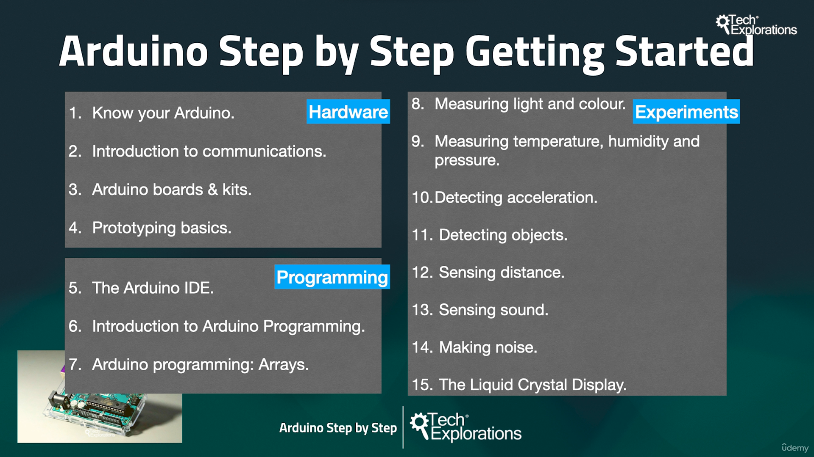

1. [What is this course about?](#1)
2. [Parts you will need](#2)
3. [Tools you will need](#3)
4. [How to get the most out of this course](#4)
5. [Update 2022 brief](#5)

---

### 1. What is this course about?

### 2. Parts you will need

- List of components [click me](https://techexplorations.com/parts/asbs-gs-parts-tools/)

#### Sensor category

- Environment sensor( 💡can group sensor according to use case in Table format for easy search )
- Motion sensor
- Distance sensor
- Sound sensor

### 3. Tools you will need

- List of tools [click me](https://techexplorations.com/parts/asbs-gs-parts-tools/)

### 4. How to get the most out of this course

- Course original repository [click me](https://github.com/futureshocked/ArduinoSbSGettingStarted)

### 5. Update 2022 brief
