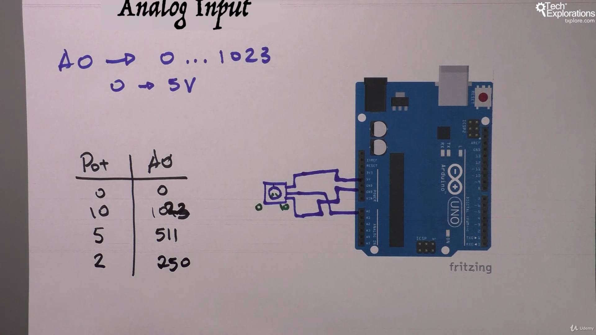

6. [Introduction to this section](#6)
7. [The Arduino Uno over the years](#7)
8. [Getting to know the Arduino Uno: Atmega328P, USB, Shields](#8)
9. [Getting to know the Arduino Uno: Pins, power, clock](#9)
10. [Using the digital output pins](#10)
11. [Using the digital input pins](#11)
12. [Using the analog output pins](#12)
13. [Using the analog input pins](#13)
    Quiz 1: End of section quiz

---

### 6. Introduction to this section

### 7. The Arduino Uno over the years

- genuine vs compatible arduino board

### 8. Getting to know the Arduino Uno: Atmega328P, USB, Shields

- no operating system
- ram, processor, storage
- Atmega328p is microcontroller for general purpose, Atmeaga16u2 use for usb-socket serial communication b/w computer and Atmega328p

### 9. Getting to know the Arduino Uno: Pins, power, clock

- Ardunio uno r3 documentation [click me](https://docs.arduino.cc/hardware/uno-rev3/)

### 10. Using the digital output pins

A computer is a digital/binary device. It has only two state high or low, 5v or 0v, 1 or 0

#### Digital pins as Output

### 11. Using the digital input pins

- Pull up and Pull down resistor, explanation ref [click me](https://techexplorations.com/blog/electronics/blog-what-are-pull-up-and-pull-down-resistors/)

#### Digital pins as Input

### 12. Using the analog output pins

- PWM concept [click me](https://docs.arduino.cc/learn/microcontrollers/analog-output/)

#### Analog pins as Output

### 13. Using the analog input pins

Analog pin used for reading sensor info

#### Analog pins as Input

-💡 using potentiometer to control brightness of LED

