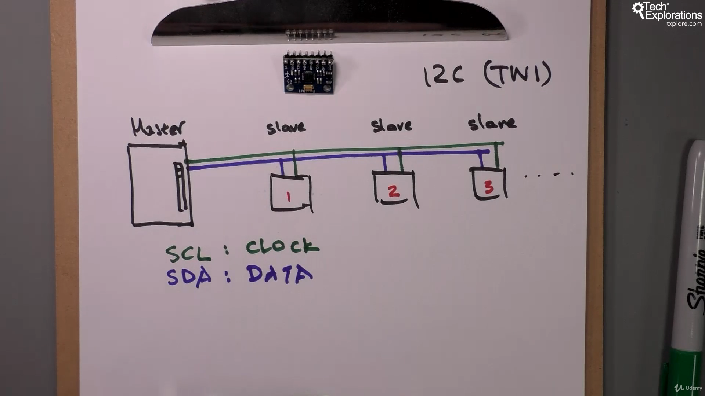

14. [Introduction to this section](#14)
15. [Serial (UART) communications](#15)
16. [I²C (TWI) communications](#16)
17. [SPI communications](#17)

---

### 14. Introduction to this section

### 15. Serial (UART) communications

- Arduino r3 documentation [click me](https://docs.arduino.cc/hardware/uno-rev3/)
- Arduino r3 documentation "serial communication library" [click me](https://docs.arduino.cc/learn/built-in-libraries/software-serial/)
- Wikipedia page [click me](https://en.wikipedia.org/wiki/Universal_asynchronous_receiver-transmitter)

notice

We can use software to emulate UART-hardware serial functionality that comes with arduino, so we use software to simulate hardware

### 16. I²C (TWI) communications

- Ardunio uno r3 documentation [click me](https://docs.arduino.cc/hardware/uno-rev3/)
- Wikipedia page [click me](https://en.wikipedia.org/wiki/Ic)
- Wikipedia page [click me](<https://en.wikipedia.org/wiki/Bus_(computing)>)
- Ardunio uno r3 library documentation [click me](https://www.arduino.cc/reference/en/language/functions/communication/wire/)

notice

- Because of trademark issue I2C by phillip other company name same protocol as TWI
- TWI: broadcast communication

### 17. SPI communications

- Wikipedia page [click me](<https://en.wikipedia.org/wiki/Duplex_(telecommunications)>)
