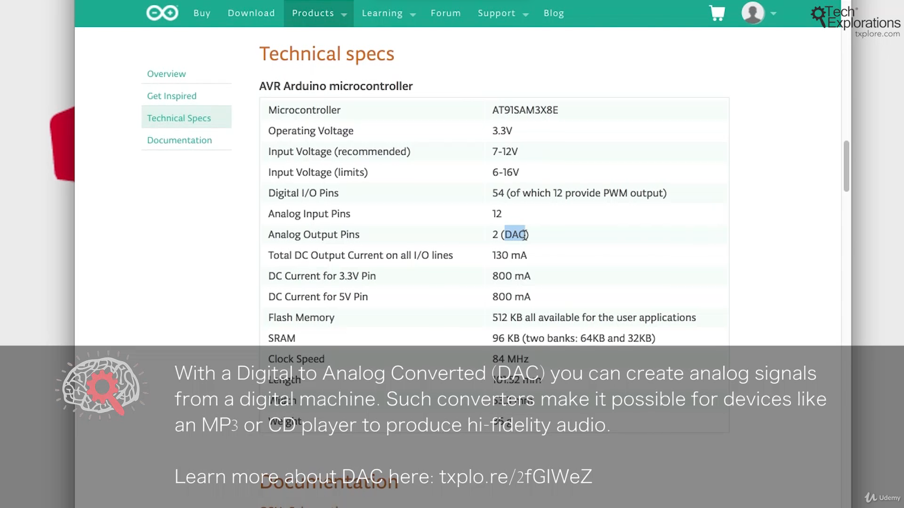

18. [Introduction to this section](#18)
19. [Arduinos past and present](#19)
20. [Classic Arduinos](#20)
21. [Meet some members of the Arduino family](#21)
22. [Introducing the Arduino Mega 2560](#22)
23. [Introducing the Arduino Due](#23)
24. [Introducing the Arduino Zero](#24)
25. [Introducing the Arduino Pro Mini](#25)
26. [Introducing Arduino-compatible boards](#26)
27. [Modern Arduinos](#27)
28. [Arduino MKR](#28)
29. [Arduino Nano](#29)
30. [Kits](#30)
31. [Arduino Student Kit](#31)
32. [Arduino Explore IoT Kit](#32)
33. [Seeed Studio Arduino Sensor kit](#33)
34. [DFRobot Beginner Kit for Arduino](#34)

---

### 18. Introduction to this section

### 19. Arduinos past and present

notice

- Most of the development board available in the market are inspired from arduino open source "board design"

### 20. Classic Arduinos

#### How explore arduino boarda

- Go to arduino site[Click me](https://www.arduino.cc/) --> Hardware(sidebar)--> Boards(sidebar)

### 21. Meet some members of the Arduino family

- Arduino uno is 8-bit architecture

#### How read technical specification of arduino Uno boarda

- Go to arduino site[Click me](https://www.arduino.cc/) --> Hardware(sidebar)--> Classic(dropdown)--> UNO R3--> TechSpec(nav-tab)
- Direct link [Click me](https://docs.arduino.cc/hardware/uno-rev3/)

notice

- The uno board technical specification look like i'm reading my samsung mobile phone specification

### 22. Introducing the Arduino Mega 2560

- Arduino mega is 8-bit architecture

#### How read technical specification of arduino boarda

- Go to arduino site[Click me](https://www.arduino.cc/) --> Hardware(sidebar)--> Mega family--> Arduino Mega 2560 Rev3--> TechSpec(nav-tab)
- Direct link [Click me](https://store.arduino.cc/products/arduino-mega-2560-rev3?_gl=1*8ntqzt*_ga*MTg2NjIyNTQ4My4xNzEzMjUyMDM3*_ga_NEXN8H46L5*MTcxMzMyOTM3OC42LjEuMTcxMzMzMjI2Mi4wLjAuNTI2MTkzODcy*_fplc*TnZ4JTJGVkNneVB5VzVCMFczYUZYRnVKVlViSmhwU0ZSbHVjSmtNZGF2RDAwcnh0clVTZzA1SktPS2Q0ZW5OJTJCdGFaSklIdExBcUlvSWF5QTMyakZ6Zll6VjdVaVpmVXU0YVp0ZnJBY1BrdGgwNFAlMkZ6TTM3dng4NVVSY0VvS01BJTNEJTNE)

### 23. Introducing the Arduino Due

Playing music mp3

- Arduino due is 32-bit architecture, based on ARM architecture
- Go to arduino site[Click me](https://www.arduino.cc/) --> Hardware(sidebar)--> Mega family--> Arduino Due--> TechSpec(nav-tab)
- Direct link [Click me](https://store.arduino.cc/products/arduino-due)

- Wikipedia page on DAC [Click me](https://en.wikipedia.org/wiki/Digital-to-analog_converter)

notice

- I have used 8-bit architecture nes gaming console
- I have used 32-bit architecture Desktop "gta 5"
- Now I'm using 64-bit architecture Laptop "Video editing"

### 24. Introducing the Arduino Zero

- Arduino zero is 32-bit architecture
- Go to arduino site[Click me](https://www.arduino.cc/) --> Hardware(sidebar)--> Classic family--> Arduino zero--> TechSpec(nav-tab)
- Direct link [Click me](https://store.arduino.cc/products/arduino-zero?_gl=1*tni4xg*_ga*MTg2NjIyNTQ4My4xNzEzMjUyMDM3*_ga_NEXN8H46L5*MTcxMzMyOTM3OC42LjEuMTcxMzMzNDA2MS4wLjAuNTI2MTkzODcy*_fplc*TnZ4JTJGVkNneVB5VzVCMFczYUZYRnVKVlViSmhwU0ZSbHVjSmtNZGF2RDAwcnh0clVTZzA1SktPS2Q0ZW5OJTJCdGFaSklIdExBcUlvSWF5QTMyakZ6Zll6VjdVaVpmVXU0YVp0ZnJBY1BrdGgwNFAlMkZ6TTM3dng4NVVSY0VvS01BJTNEJTNE)

### 25. Introducing the Arduino Pro Mini

- Arduino pro mini is 8-bit architecture

notice

- The chip inside the arduino uno and arduino pro min are same.
- The difference is in package DIP VS SMD

### 26. Introducing Arduino-compatible boards

- [Particle electron](https://www.particle.io/iot-connectivity/)
- [leo stick](https://www.freetronics.com.au/products/leostick)
- [Digispark pro](https://www.kickstarter.com/projects/digistump/digispark-pro-tiny-arduino-ready-mobile-and-usb-de)
- [Node mcu](https://www.nodemcu.com/index_en.html)
- [ESP8266](https://en.wikipedia.org/wiki/ESP8266)

### 27. Modern Arduinos

- [Modern arduino](https://www.arduino.cc/en/hardware#mkr-family)

### 28. Arduino MKR

- [Arduino MKR wifi 1010](https://store.arduino.cc/products/arduino-mkr-wifi-1010?_gl=1*1ktxjhg*_ga*MTg2NjIyNTQ4My4xNzEzMjUyMDM3*_ga_NEXN8H46L5*MTcxMzMzNzY1OS43LjEuMTcxMzMzODE5NS4wLjAuMTQ5NzExNjEyMA..*_fplc*VnQwRk10Zm8lMkZEZ1JZaUR3MHB0RWJhMSUyRkc5ajBwdTIzY3pFUWJiSSUyRjFpajZMbUQ5RVFWRUwwcXNjQ0pFamdrWjAzYzllRzZJRlZCandkUW9TTG5JU2psN2VFWnAxcUtVU1VURUVXMFRsOTFQWExIbGJXOEwyWm41b2RHUEdnJTNEJTNE)

### 29. Arduino Nano

left nano Vs right MKR

- [Arduino nano 33 iot](https://store-usa.arduino.cc/products/arduino-nano-33-iot?_gl=1*1t3t8e7*_ga*MTg2NjIyNTQ4My4xNzEzMjUyMDM3*_ga_NEXN8H46L5*MTcxMzMzNzY1OS43LjEuMTcxMzMzODczMi4wLjAuMTQ5NzExNjEyMA..*_fplc*VnQwRk10Zm8lMkZEZ1JZaUR3MHB0RWJhMSUyRkc5ajBwdTIzY3pFUWJiSSUyRjFpajZMbUQ5RVFWRUwwcXNjQ0pFamdrWjAzYzllRzZJRlZCandkUW9TTG5JU2psN2VFWnAxcUtVU1VURUVXMFRsOTFQWExIbGJXOEwyWm41b2RHUEdnJTNEJTNE&selectedStore=us)

### 30. Kits

### 31. Arduino Student Kit

- [Arduino student kit](https://store-usa.arduino.cc/products/arduino-student-kit?selectedStore=us)

### 32. Arduino Explore IoT Kit

- [Arduino explore iot kit](https://store.arduino.cc/products/arduino-explore-iot-kit)

### 33. Seeed Studio Arduino Sensor kit

- [Arduino Sensor Kit by Seed](https://www.seeedstudio.com/Arduino-Sensor-Kit-Base-p-4743.html)

### 34. DFRobot Beginner Kit for Arduino

- [Arduino beginner Kit by DFRobot](https://www.dfrobot.com/product-345.html)
