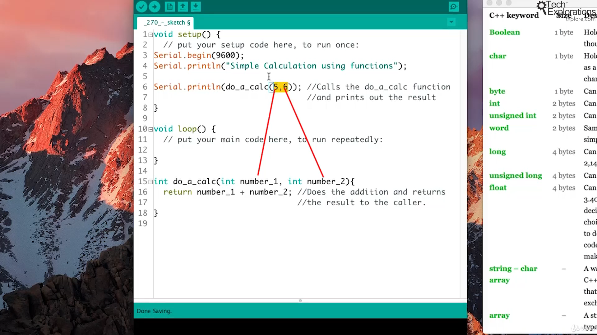
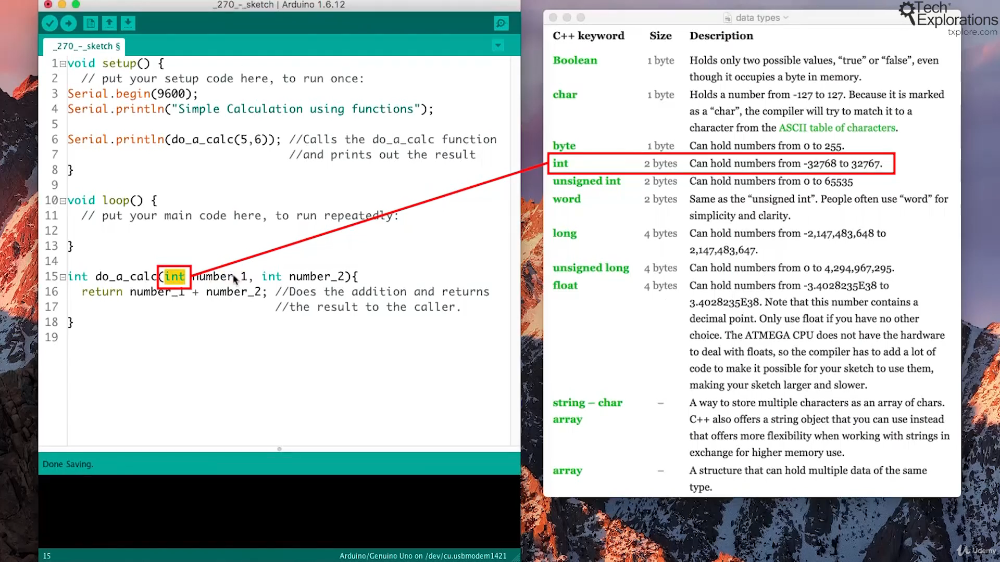
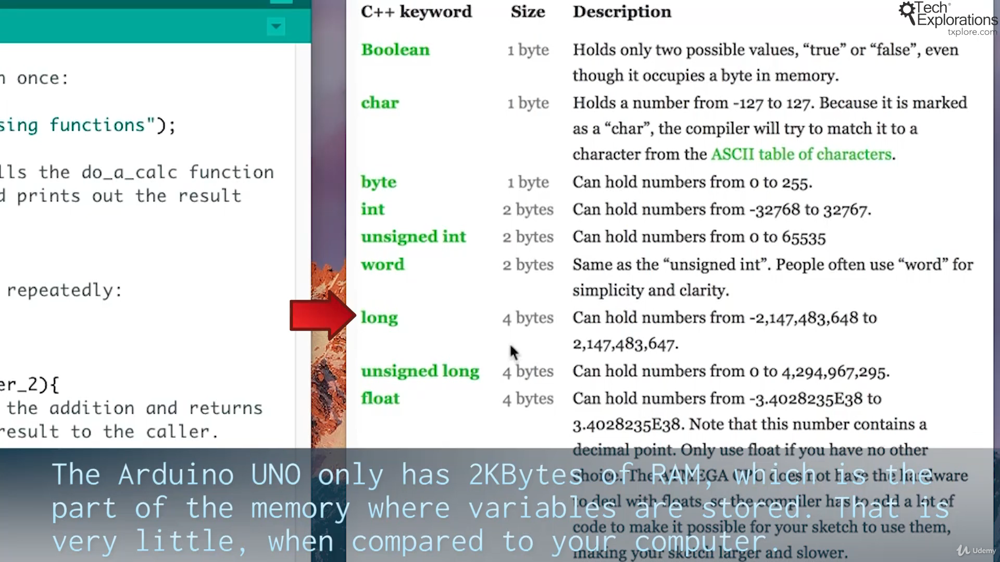
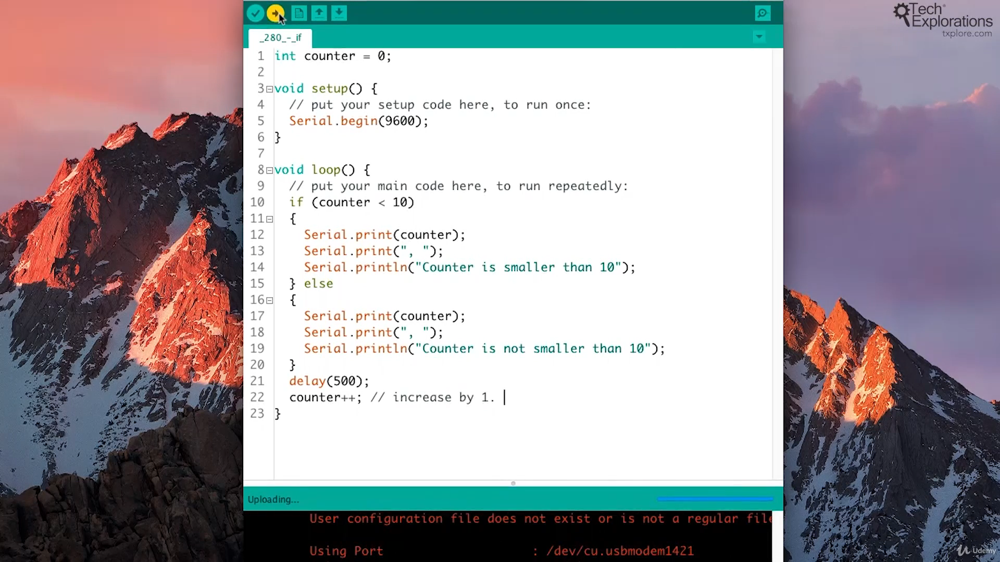

59. [Introduction to this section](#59)
60. [An introduction to Arduino programming](#60)
61. [Understand the basic parts of an Arduino sketch](#61)
62. [Getting started with custom functions](#62)
63. [Creating custom functions and the return keyword](#63)
64. [Using variables](#64)
65. [Understanding variable scope](#65)
66. [Understanding constants](#66)
67. [Introduction to control structures: The "if" statement](#67)
68. [Introduction to control structures: The "while" statement](#68)
69. [Introduction to control structures: The "For" statement](#69)
70. [Introduction to control structures: The "Switch" statement](#70)
71. [Digital output - how to control an LED](#71)
72. [Digital input - how to read the state of a button](#72)
73. [Analog input - how to read the state of a potentiometer](#73)
74. [Analog output - how to create a fading LED](#74)
75. [Introduction to the RGB (color) LED](#75)
76. [Wiring the RGB LED](#76)
77. [RGB LED: creating colors](#77)
78. [Using a library to control an RGB LED with PWM](#78)
79. [Learning more with the Arduino language documentation](#79)

---

### 59. Introduction to this section<a id="59"></a>

### 60. An introduction to Arduino programming<a id="60"></a>


<br>

Arduino programming language is a subset of C++


<br>


<br>


<br>


<br>


### 61. Understand the basic parts of an Arduino sketch<a id="61"></a>


#### How to setup serial communication from Arduino board to PC.

- Upload sketch

```ino
void setup() {
  // setup serial comm from arduino------>PC
  Serial.begin(9600);
  Serial.println("Hello");

}

void loop() {

  Serial.println(millis());
  // 1sec delay
  delay(1000);
}

```

- On PC Arduino IDE, click on serial monitor

---

- Ardunio documentation, setup() function [click me](https://www.arduino.cc/reference/en/language/structure/sketch/setup/)
- Ardunio documentation, millis() function [click me](https://www.arduino.cc/reference/en/language/functions/time/millis/)

### 62. Getting started with custom functions<a id="62"></a>


**1 Function without input**

#### How define custom function, Where to call custom function

- upload sketch

```ino
void setup() {
  // setup serial comm from arduino------>PC
  Serial.begin(9600);
  Serial.println("---Simple calculation function---");

  //2. calling custom function
  do_a_calc();


}

void loop() {

}

// function anatomy: return_type function_name braces
// 1. defining custom function
int do_a_calc(){
  Serial.println(1+1);
}
```

- On PC Arduino IDE, click on serial monitor

---

**2 Function with input**

#### How define custom function with input, Where to call custom function

- upload sketch

```ino
void setup() {
  // setup serial comm from arduino------>PC
  Serial.begin(9600);
  Serial.println("---Simple calculation function---");

  //2. calling custom function by proving input value
  do_a_calc(5,7);


}

void loop() {

}

// function anatomy: return_type function_name braces
// 1. defining custom function with input
int do_a_calc(int number_1, int number_2){
  Serial.println(number_1 + number_2);
}
```

- On PC Arduino IDE, click on serial monitor

### 63. Creating custom functions and the return keyword<a id="63"></a>

**3 Function with output aka return-type function**

#### How define custom function with input, Where to call custom function

- upload sketch

```ino
void setup() {
  // setup serial comm from arduino------>PC
  Serial.begin(9600);
  Serial.println("---Simple calculation function---");

  //2. calling a return-type function
  Serial.println(do_a_calc(5,10));
}

void loop() {

}

// function anatomy: return_type function_name braces
// 1. defining return-type function with input
int do_a_calc(int number_1, int number_2){
  return number_1 + number_2;
}
```

- On PC Arduino IDE, click on serial monitor

### 64. Using variables<a id="64"></a>








- upload sketch

```ino
void setup() {
  // setup serial comm from arduino------>PC
  Serial.begin(9600);
  Serial.println("---Simple calculation function---");

int first_number = 5;
int second_number = 10;

second_number = 20;
  //2. calling a return-type function by passing variable
  Serial.println(do_a_calc(first_number, second_number));
}

void loop() {

}


// 1. defining return-type function
int do_a_calc(int number_1, int number_2){
  int result = number_1 + number_2;
  return result;
}
```

- On PC Arduino IDE, click on serial monitor

### 65. Understanding variable scope<a id="65"></a>


### 66. Understanding constants<a id="66"></a>


### 67. Introduction to control structures: The "if" statement<a id="67"></a>



- Ardunio uno r3 documentation if-statement [click me](https://www.arduino.cc/reference/en/language/structure/control-structure/if/)

- Ardunio uno r3 documentation else-statement [click me](https://www.arduino.cc/reference/en/language/structure/control-structure/else/)

### 68. Introduction to control structures: The "while" statement<a id="68"></a>


- Ardunio uno r3 documentation while loop [click me](https://www.arduino.cc/reference/en/language/structure/control-structure/while/)

### 69. Introduction to control structures: The "For" statement<a id="69"></a>


- Ardunio uno r3 documentation for loop [click me](https://www.arduino.cc/reference/en/language/structure/control-structure/for/)

### 70. Introduction to control structures: The "Switch" statement<a id="70"></a>


- Ardunio uno r3 documentation switch loop [click me](https://www.arduino.cc/reference/en/language/structure/control-structure/switchcase/)

- Ardunio uno r3 documentation reference [click me](https://www.arduino.cc/reference/en/)

### 71. Digital output - how to control an LED<a id="71"></a>

Component used


<br>

LED pins


<br>

Schematic configuration


<br>

Sketch


```ino

// the setup function runs once when you press reset or power the board
void setup() {
  // initialize digital pin LED_BUILTIN as an output.
  pinMode(LED_BUILTIN, OUTPUT);
}

// the loop function runs over and over again forever
void loop() {
  digitalWrite(LED_BUILTIN, HIGH);  // turn the LED on (HIGH is the voltage level)
  delay(1000);                      // wait for a second
  digitalWrite(LED_BUILTIN, LOW);   // turn the LED off by making the voltage LOW
  delay(1000);                      // wait for a second
}
```

- File--> example--> basic--> Blink
- Ardunio uno r3 documentation pinMode() function [click me](https://www.arduino.cc/reference/en/language/functions/digital-io/pinmode/)
- Ardunio uno r3 documentation digitalWrite() function [click me](https://www.arduino.cc/reference/en/language/functions/digital-io/digitalwrite/)
- Ardunio uno r3 documentation delay() function [click me](https://www.arduino.cc/reference/en/language/functions/time/delay/)

### 72. Digital input - how to read the state of a button<a id="72"></a>


- Pull-up and pull-down register concept [click me](https://techexplorations.com/guides/arduino/common-circuits/pull-up-and-pull-down-resistors/)
- Wiki relational operator [click me](https://en.wikipedia.org/wiki/Relational_operator)

Note

- pull-down resistor: no current comes from pin, but arduino pin sense/read coming voltage from Vcc

### 73. Analog input - how to read the state of a potentiometer<a id="73"></a>

PWM definition


<br>

components


<br>

working of potentiometer


<br>

configuration


<br>

sketch


<br>

In action


- Ardunio uno r3 documentation analogRead() function [click me](https://www.arduino.cc/reference/en/language/functions/analog-io/analogread/)

- Wiki potentiometer [click me](https://en.wikipedia.org/wiki/Potentiometer)

<br>

Note

- Analog read value from 0-1023

### 74. Analog output - how to create a fading LED<a id="74"></a>

PWM


- Red will make LED, glow brighter, as it turn on for long duration
- Blue will make LED, glow dim, as it turn off for long duration

---

<br>

component


<br>

Configuration


<br>

Sketch


- Ardunio uno r3 documentation Basics of PWM (Pulse Width Modulation) [click me](https://docs.arduino.cc/learn/microcontrollers/analog-output/)
- Ardunio uno r3 documentation analogWrite() function [click me](https://www.arduino.cc/reference/en/language/functions/analog-io/analogwrite/)
- Ardunio uno r3 documentation map() function [click me](https://www.arduino.cc/reference/en/language/functions/math/map/)

Note-

- The analogRead() function reads value from 0-1023
- The analogWrite() function write value from 0-255
- Thats why we need map() function to map value (scale in)

### 75. Introduction to the RGB (color) LED<a id="75"></a>

library definition


<br>

Testing LED with coin battery


<br>

Common cathode: long pin is -ive in this LED


<br>

Amazing engineering


- Wiki LED [click me](https://en.wikipedia.org/wiki/Light-emitting_diode#RGB)

### 76. Wiring the RGB LED<a id="76"></a>

Testing LED color by drawing current from arduino vcc


<br>

attaching red wire after finding color of LED; Testing LED color by drawing current from arduino vcc


<br>

attaching green wire after finding color of LED


<br>

Testing LED color by drawing current from arduino vcc


<br>

attaching blue wire after finding color of LED


```ino

//const int red_pin = 3;

#define RED_PIN   3
#define BLUE_PIN  6
#define GREEN_PIN 5

// the setup function runs once when you press reset or power the board
void setup() {
  // initialize digital pin LED_BUILTIN as an output.
  pinMode(RED_PIN, OUTPUT);
  pinMode(BLUE_PIN, OUTPUT);
  pinMode(GREEN_PIN, OUTPUT);
}

// the loop function runs over and over again forever
void loop() {
  digitalWrite(GREEN_PIN, LOW);
  digitalWrite(RED_PIN, HIGH);   // turn the LED on (HIGH is the voltage level)
  delay(1000);                       // wait for a second

  digitalWrite(RED_PIN, LOW);    // turn the LED off by making the voltage LOW
  digitalWrite(BLUE_PIN, HIGH);
  delay(1000);                       // wait for a second

  digitalWrite(BLUE_PIN, LOW);    // turn the LED off by making the voltage LOW
  digitalWrite(GREEN_PIN, HIGH);
  delay(1000);
}
```

- Ardunio uno r3 documentation #define [click me](https://www.arduino.cc/reference/en/language/structure/further-syntax/define/)

### 77. RGB LED: creating colors<a id="77"></a>

White color. if we calibrate current limiting resistor


```ino
#define RED_PIN   3
#define BLUE_PIN  6
#define GREEN_PIN 5

// the setup function runs once when you press reset or power the board
void setup() {
  // initialize digital pin LED_BUILTIN as an output.
  pinMode(RED_PIN, OUTPUT);
  pinMode(BLUE_PIN, OUTPUT);
  pinMode(GREEN_PIN, OUTPUT);
}

// the loop function runs over and over again forever
void loop() {
  analogWrite(GREEN_PIN, 50);
  analogWrite(RED_PIN, 100);
  analogWrite(BLUE_PIN, 100);
}

```

### 78. Using a library to control an RGB LED with PWM<a id="78"></a>

#### How to install library in local system

- Open arduino go to sketch--> include library--> manage libraries--> search: "ALA" by bportaluri--> install

<br>

#### Where do arduino store all my libraries

- Open arduino go to file--> preference--> sketchbook location (dig some level and find libraries-folder)

<br>

##### How to open boiler plate sketch


- Open arduino go to file --> example--> ALA--> simpleRGBLED

```ino
// Object oriented programming paradigm

#include <AlaLedRgb.h>

#define REDPIN 3
#define GREENPIN 5
#define BLUEPIN 6


// create a new object from AlaLedRgb class
AlaLedRgb rgbLed;

void setup()
{
  rgbLed.initPWM(REDPIN, GREENPIN, BLUEPIN);                 // initialize output pins
  rgbLed.setBrightness(0x66FF44);                            // calibrate white
  rgbLed.setAnimation(ALA_FADECOLORSLOOP, 5000, alaPalRgb);  // set the animation
}

void loop()
{
  rgbLed.runAnimation();  // run the animation indefinitely
}


```

---

#### How to get more animation effect

- github Arduino Light Animation (ALA) library animation configuration [click me](https://yaab-arduino.blogspot.com/p/ala-animations.html)

```ino
///////////////////////////////////////////////////////////////////////////////////////////
//
// ALA library example: SimpleRgbLed
//
// Example to demonstrate how to create a color-fading animation for one RGB LED.
//
// Web page: http://yaab-arduino.blogspot.com/p/ala-example-simplergbled.html
//
///////////////////////////////////////////////////////////////////////////////////////////

#include <AlaLedRgb.h>

#define REDPIN 3
#define GREENPIN 5
#define BLUEPIN 6


// create a new object from AlaLedRgb class
AlaLedRgb rgbLed;

void setup()
{
  rgbLed.initPWM(REDPIN, GREENPIN, BLUEPIN);                 // initialize output pins
  rgbLed.setBrightness(0x66FF44);                            // calibrate white

  // 1️⃣ refer from documentation, Put GLOW in front of ALA_ to change LED animation effect
  rgbLed.setAnimation(ALA_GLOW, 5000, alaPalRgb);  // set the animation
}

void loop()
{
  rgbLed.runAnimation();  // run the animation indefinitely
}

```

<br>

- Ardunio uno r3 documentation analogWrite() function [click me](https://www.arduino.cc/reference/en/language/functions/analog-io/analogwrite/)
- Wiki class concept [click me](<https://en.wikipedia.org/wiki/Class_(computer_programming)>)
- github Arduino Light Animation (ALA) library [click me](https://github.com/bportaluri/ALA)

### 79. Learning more with the Arduino language documentation<a id="79"></a>
