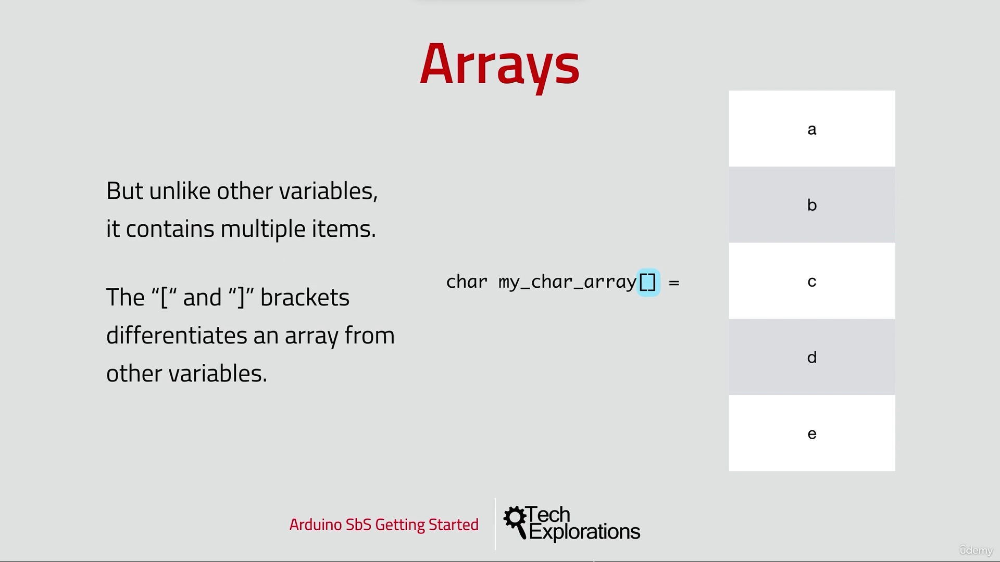

80. [Introduction to this section](#80)
81. [Introduction to Arrays](#81)
82. [Arrays, Example 1](#82)
83. [Arrays, Example 2](#83)
84. [Arrays, Example 3](#84)
85. [Arrays, Example 4](#85)

---

### 80. Introduction to this section<a id="80"></a>

### 81. Introduction to Arrays<a id="81"></a>

Definition


<br>

Array store same type of element


<br>

How to define array in arduino programming



<br>

#### How to access data item from array using index


<br>

#### How to modify/change date item inside array


<br>

#### How to get data item from array


<br>

#### How to iterate and retrive data from array


<br>

### 82. Arrays, Example 1<a id="82"></a>

```ino
/*
 *  An example of how to create an use an array of integers
 *  We'll declare an array of 5 integers.
 *  We'll print the contents in the serial monitor.
 *  We'll do some calculations, store the results, and print the results in the serial monitor.
 *
 */

int my_integers[5] = {1, 2, 3, 4, 5} ;  // We want this array to contain 5 integers,
                                        // so we'll declare it with size 5.

void setup() {
  Serial.begin(9600);

  while (!Serial) {
    ; // wait for serial port to connect. Needed for native USB
  }

  Serial.println("Your array numbers:");
  for (int i = 0; i<5; i++)     // Experiment to see what happens if your index goes out of bounds
  {
    Serial.print("Index ");
    Serial.print(i);
    Serial.print(" contains value ");
    Serial.println(my_integers[i]);
  }

  Serial.println();
  Serial.println("Let's do some calculations:");
  for (int i = 0; i<4; i++)
  {
    Serial.print(my_integers[i]);
    Serial.print(" + ");
    Serial.print(my_integers[i+1]);
    Serial.print(" = ");
    Serial.println(my_integers[i] + my_integers[i+1]);
  }

  Serial.println();
  Serial.println("Let's do some calculations, and store the results:");
  for (int i = 0; i<4; i++)
  {
    Serial.print(my_integers[i]);
    Serial.print(" + ");
    Serial.print(my_integers[i+1]);
    Serial.print(" = ");
    int sum = my_integers[i] + my_integers[i+1];
    my_integers[i] = sum;
    Serial.print(my_integers[i]);
    Serial.print(" -> Index ");
    Serial.print(i);
    Serial.print(" now contains value ");
    Serial.println(my_integers[i]);
  }
}

void loop() {
  // put your main code here, to run repeatedly:

}
```

### 83. Arrays, Example 2<a id="83"></a>

```ino
/*
 *  An example of how to create an use an array of chars
 *  We'll declare an array of 5 chars.
 *  We'll print the contents in the serial monitor.
 *
 *  The table of ASCII character from https://en.wikipedia.org/wiki/ASCII
 *  is useful.
 *
 */

//char my_char[5] = {'a', 'b', 'c', 'd', 'e'} ;  // We want this array to contain 5 char,
                                               // so we'll declare it with size 5.
                                               // Try the exact same experiment with byte

//char my_char[5] = "abcde";  // Alternative definition 1

//String my_char = "abcde";   // Alternative definition 2, using a String

void setup() {
  Serial.begin(9600);

  while (!Serial) {
    ; // wait for serial port to connect. Needed for native USB
  }

  Serial.println("Your array char:");
  for (int i = 0; i<5; i++)     // Experiment to see what happens if your index goes out of bounds
  {
    Serial.print("Index ");
    Serial.print(i);
    Serial.print(" contains char '");
    Serial.print(my_char[i]);
    Serial.print("', ASCII decimal ");
    Serial.println(my_char[i], DEC);
  }

  Serial.println();
  Serial.println("Let's do some calculations:");
  for (int i = 0; i<4; i++)
  {
    Serial.print(my_char[i]);
    Serial.print(" + ");
    Serial.print(my_char[i+1]);
    Serial.print(" = ");
    Serial.println(my_char[i] + my_char[i+1]);
  }

  Serial.println();
  Serial.println("Let's do some calculations, and store the results:");
  for (int i = 0; i<4; i++)
  {
    Serial.print(my_char[i]);
    Serial.print(" + ");
    Serial.print(my_char[i+1]);
    Serial.print(" = ");
    char sum = my_char[i] + my_char[i+1];  // Beware, I am using a char here, which is
                                           // a single byte. This means that if this
                                           // calculation yields more than 256, it will
                                           // truncate without an error.
    my_char[i] = sum;
    Serial.print(my_char[i], DEC);
    Serial.print(" -> Index ");
    Serial.print(i);
    Serial.print(" now contains value ");
    Serial.println(my_char[i], DEC);
  }
}

void loop() {
  // put your main code here, to run repeatedly:
}
```

### 84. Arrays, Example 3<a id="84"></a>

```ino
/*
 * Control an LED using an array.
 *
 * Create a pattern with LED on and off information in one array,
 * and on/off durations in a second array.
 *
 *
 */

const int ledPin             = 7;
const int totalStates        = 9;
int ledState[totalStates]    = {1,  0,  1,  0,  1,  0,  0,  1,   0};
int ledDuration[totalStates] = {200,400,500,100,200,50, 50, 500, 500 };

void setup() {
  pinMode(ledPin, OUTPUT);
}

void loop() {
  for (int i = 0; i < totalStates; i++)
   {
    digitalWrite(ledPin,ledState[i]);
    delay(ledDuration[i]);
   }
}
```

### 85. Arrays, Example 4<a id="85"></a>

```ino
/*
 * Control an LED using an array, like in example 3, but the
 * pattern is configurable.
 *
 * Create a pattern with LED on and off information in one array,
 * and on/off durations in a second array.
 *
 *
 */

const int ledPin             = 7;
const int totalStates        = 9;
int ledState[totalStates]; // undefined, we'll ask the user for input
int ledDuration[totalStates] = {200,400,500,100,200,50, 50, 500, 500 };

void setup() {
  pinMode(ledPin, OUTPUT);
  Serial.begin(9600);
  while (!Serial) {
    ; // wait for serial port to connect. Needed for native USB
  }

  for (int i = 0; i < totalStates; i++)
   {
    Serial.print("Please type 1 or 0 for pattern step ");
    Serial.print(i);
    Serial.print(" out of ");
    Serial.print(totalStates - 1);
    Serial.print(" (default is 1): ");

    while (Serial.available()==0)
    {
    }

    char userInput = Serial.read();
    if (userInput == '1')
      ledState[i] = 1;
    else if (userInput == '0')
      ledState[i] = 0;
    else
      ledState[i] = 1;

    Serial.println(ledState[i]);
   }
   Serial.println("Thank you, now let's blink this LED using this pattern:");
   for (int i = 0; i < totalStates; i++)
   {
    Serial.print("Step ");
    Serial.print(i);
    Serial.print(" state is: ");
    Serial.print(ledState[i]);
    Serial.print(" with duration ");
    Serial.println(ledDuration[i]);
   }
}

void loop() {
  for (int i = 0; i < totalStates; i++)
   {
    digitalWrite(ledPin,ledState[i]);
    delay(ledDuration[i]);
   }
}
```
