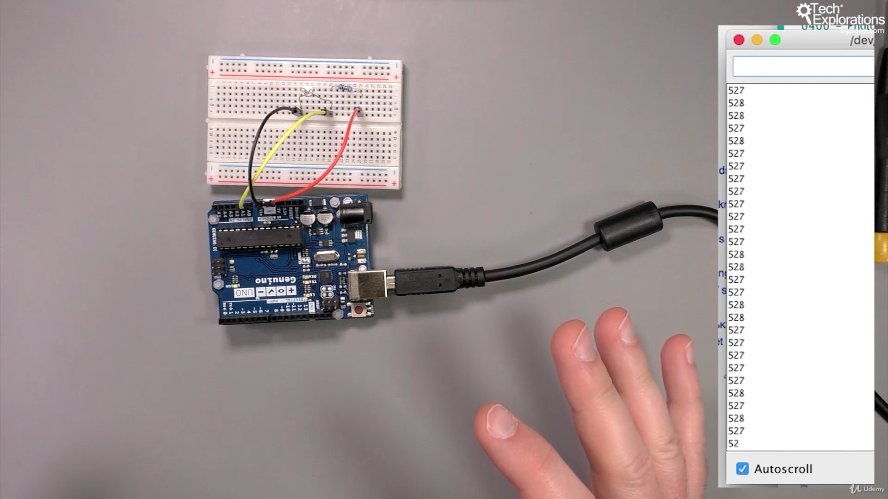

86. [Introduction to this section](#86)
87. [What is a photoresistor and how to wire it](#87)
88. [How to select the appropriate fixed resistor for a photoresistor](#88)
89. [Using the Ultra-Violet light sensor](#89)
90. [An introduction to the RGB Color sensor](#90)
91. [Wiring the RGB Color sensor](#91)
92. [Mini project: copy a color to an RGB LED using an RGB Color sensor](#92)

---

### 86. Introduction to this section<a id="86"></a>

### 87. What is a photoresistor and how to wire it<a id="87"></a>

#### Component

- A photo-resistor is an analog sensor
- Its a non-polarized device
- It work with voltage divider circuit configuration
- depending on fixed resistor and LDR the analogRead give different resistance value
- analogRead() give value from 0-1023

#### 1 Voltage divider configuration: fixed resistor top + LDR bottom

- High brightness: resistance low
- ambient(room light) brightness: resistance medium
- Darkness: resistance high

#### 2 Voltage divider configuration: LDR top + fixed resistor bottom

- High brightness: resistance high
- ambient(room light) brightness: resistance medium
- Darkness: resistance low


<br>

Schematic diagram


<br>

Configuration 1: fixed resistor on top LDR bottom


```ino
/*  Photo-light sensor demo sketch
 *
 * This sketch gets an analog reading from a photosensor.
 * A photosensor is a light-dependant resistor (LDR).
 * The reading is proportional to the ambient light.
 *
 * This sketch was written for Arduino Step by Step by Peter Dalmaris.
 *
 * Components
 * ----------
 *  - Arduino Uno
 *  - Light sensor
 *  - 10 kΩ resistor (or close)
 *
 *  Libraries
 *  ---------
 *  - NONE
 *
 * Connections
 * -----------
 *
 * Connect the Arduino 5V pin to one end of the
 * LDR. Connect the resistor to the Arduino GND
 * pin. Connect the free pins on the LDR and
 * resistor together. Connect the LDR and resistor
 * junction to the Arduino analog pin 0. This
 * structure is called a "voltage divider".
 *                    10 kΩ
 *  5V -----OOO------\/\/\/-----GND
 *                |
 *                |
 *                |
 *                A0
 *
 *
 * Other information
 * -----------------
 * For information on the photoresistors: https://en.wikipedia.org/wiki/Photoresistor
 * For information on the voltage divider: https://en.wikipedia.org/wiki/Voltage_divider
 * For a voltage divider calculator go to: http://txplo.re/2e65gSX
 *
 * Created on October 8 2016 by Peter Dalmaris
 *
 */

// the setup routine runs once when you press reset:
void setup() {
  // initialize serial communication at 9600 bits per second:
  Serial.begin(9600);
}

// the loop routine runs over and over again forever:
void loop() {
  // read the input on analog pin 0:
  int sensorValue = analogRead(A0);
  // print out the value you read:
  Serial.println(sensorValue);
  delay(10);
}
```

- Wiki voltage divider concept [click me](https://en.wikipedia.org/wiki/Voltage_divider)

### 88. How to select the appropriate fixed resistor for a photoresistor<a id="88"></a>

#### How to get fixed resistor value


<br>

#### ambient(room) light: value medium



<br>

#### Darkness : value high


<br>

#### Brightness : value low


- Wiki Photoresistor [click me](https://en.wikipedia.org/wiki/Photoresistor)
- Wiki voltage divider concept [click me](https://en.wikipedia.org/wiki/Voltage_divider)
- google spreadsheet voltage divider calculator [click me](https://docs.google.com/spreadsheets/d/1U4fX1gv7U2Is3C7FE_dCmhFSCrBMLUqpa-CpYUxItxU/edit#gid=0)

Note-

- After testing ambient light resistance of LDR put, ambient light resistance value in R2 in voltage divider formula

### 89. Using the Ultra-Violet light sensor<a id="89"></a>

### 90. An introduction to the RGB Color sensor<a id="90"></a>

### 91. Wiring the RGB Color sensor<a id="91"></a>

### 92. Mini project: copy a color to an RGB LED using an RGB Color sensor<a id="92"></a>


- Ardunio uno r3 documentation #define [click me](https://www.arduino.cc/reference/en/language/structure/further-syntax/define/)
- Wiki class concept [click me](<https://en.wikipedia.org/wiki/Class_(computer_programming)>)
