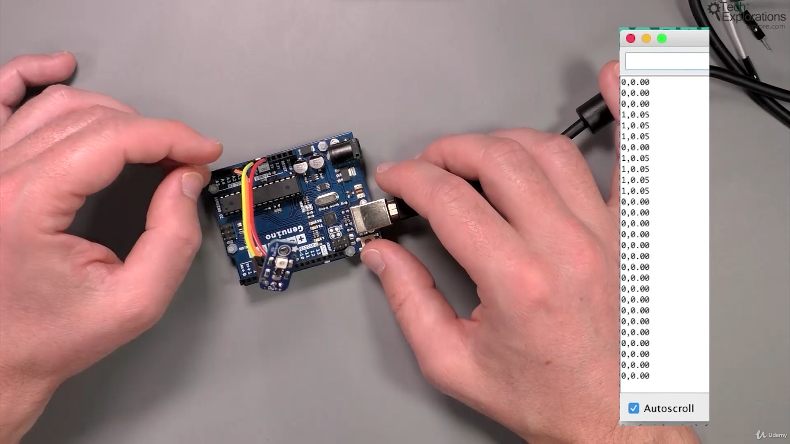
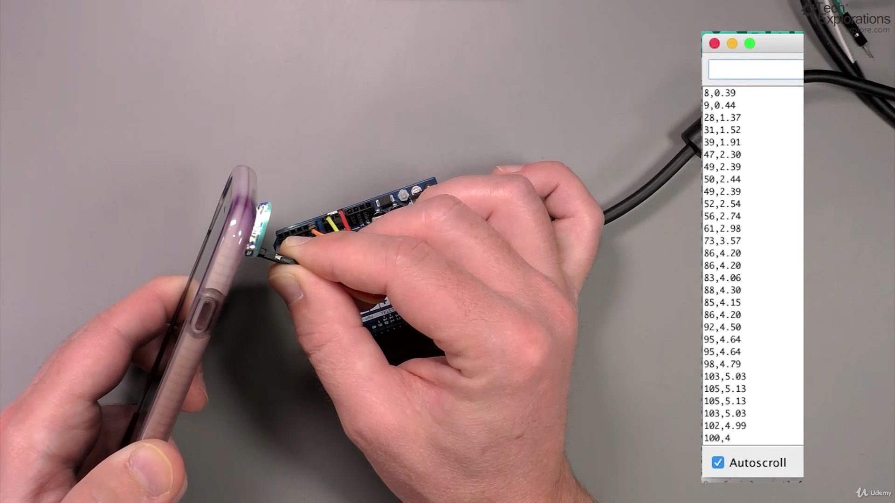
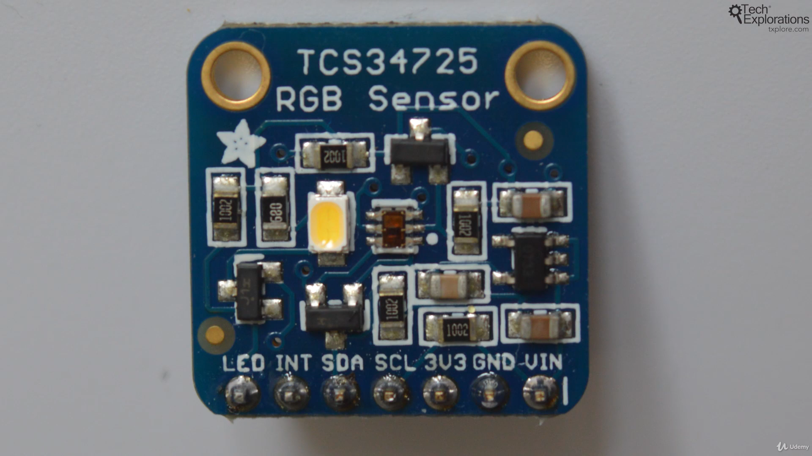
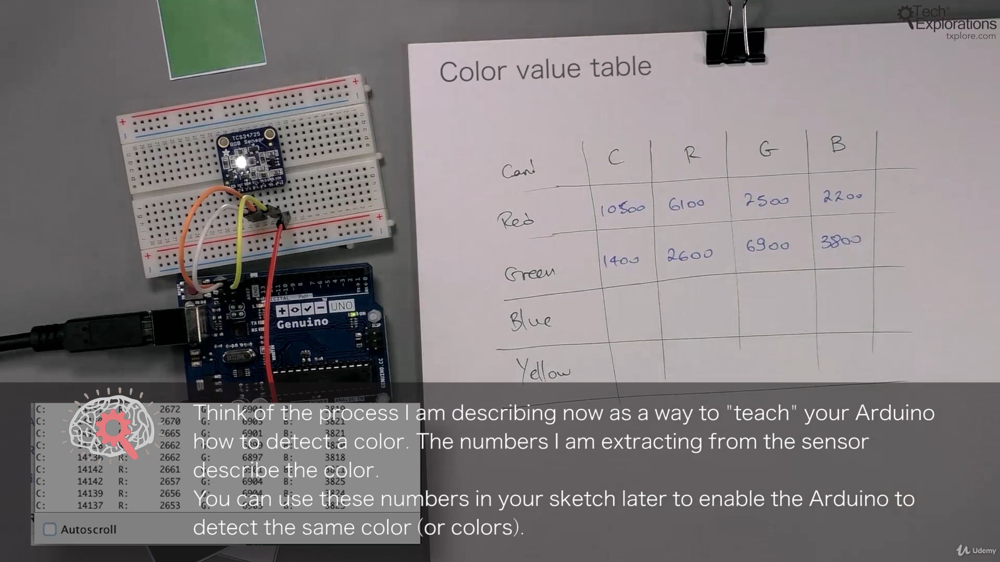

86. [Introduction to this section](#86)
87. [What is a photoresistor and how to wire it](#87)
88. [How to select the appropriate fixed resistor for a photoresistor](#88)
89. [Using the Ultra-Violet light sensor](#89)
90. [An introduction to the RGB Color sensor](#90)
91. [Wiring the RGB Color sensor](#91)
92. [Mini project: copy a color to an RGB LED using an RGB Color sensor](#92)

---

### 86. Introduction to this section<a id="86"></a>

### 87. What is a photoresistor and how to wire it<a id="87"></a>

#### Component

- A photo-resistor is an analog sensor
- Its a non-polarized device
- It work with voltage divider circuit configuration
- depending on fixed resistor and LDR the analogRead give different resistance value
- analogRead() give value from 0-1023

#### 1 Voltage divider configuration: fixed resistor top + LDR bottom

- High brightness: resistance low
- ambient(room light) brightness: resistance medium
- Darkness: resistance high

#### 2 Voltage divider configuration: LDR top + fixed resistor bottom

- High brightness: resistance high
- ambient(room light) brightness: resistance medium
- Darkness: resistance low


<br>

Schematic diagram


<br>

Configuration 1: fixed resistor on top LDR bottom


```ino
/*  Photo-light sensor demo sketch
 *
 * This sketch gets an analog reading from a photosensor.
 * A photosensor is a light-dependant resistor (LDR).
 * The reading is proportional to the ambient light.
 *
 * This sketch was written for Arduino Step by Step by Peter Dalmaris.
 *
 * Components
 * ----------
 *  - Arduino Uno
 *  - Light sensor
 *  - 10 kΩ resistor (or close)
 *
 *  Libraries
 *  ---------
 *  - NONE
 *
 * Connections
 * -----------
 *
 * Connect the Arduino 5V pin to one end of the
 * LDR. Connect the resistor to the Arduino GND
 * pin. Connect the free pins on the LDR and
 * resistor together. Connect the LDR and resistor
 * junction to the Arduino analog pin 0. This
 * structure is called a "voltage divider".
 *                    10 kΩ
 *  5V -----OOO------\/\/\/-----GND
 *                |
 *                |
 *                |
 *                A0
 *
 *
 * Other information
 * -----------------
 * For information on the photoresistors: https://en.wikipedia.org/wiki/Photoresistor
 * For information on the voltage divider: https://en.wikipedia.org/wiki/Voltage_divider
 * For a voltage divider calculator go to: http://txplo.re/2e65gSX
 *
 * Created on October 8 2016 by Peter Dalmaris
 *
 */

// the setup routine runs once when you press reset:
void setup() {
  // initialize serial communication at 9600 bits per second:
  Serial.begin(9600);
}

// the loop routine runs over and over again forever:
void loop() {
  // read the input on analog pin 0:
  int sensorValue = analogRead(A0);
  // print out the value you read:
  Serial.println(sensorValue);
  delay(10);
}
```

- Wiki voltage divider concept [click me](https://en.wikipedia.org/wiki/Voltage_divider)

### 88. How to select the appropriate fixed resistor for a photoresistor<a id="88"></a>

#### How to get fixed resistor value


<br>

#### ambient(room) light: value medium


<br>

#### Darkness : value high


<br>

#### Brightness : value low


- Wiki Photoresistor [click me](https://en.wikipedia.org/wiki/Photoresistor)
- Wiki voltage divider concept [click me](https://en.wikipedia.org/wiki/Voltage_divider)
- google spreadsheet voltage divider calculator [click me](https://docs.google.com/spreadsheets/d/1U4fX1gv7U2Is3C7FE_dCmhFSCrBMLUqpa-CpYUxItxU/edit#gid=0)

Note-

- After testing ambient light resistance of LDR put, ambient light resistance value in R2 in voltage divider formula

### 89. Using the Ultra-Violet light sensor<a id="89"></a>


<br>

#### UV index Output





- UV analog sensor adafruit product [click me](https://www.adafruit.com/product/1918)
- 1918guva UV sensor datasheet [click me](https://cdn-shop.adafruit.com/datasheets/1918guva.pdf)
- Wiki Ultraviolet topic [click me](<https://en.wikipedia.org/wiki/Ultraviolet)>)
- UV index [click me](https://www.epa.gov/sunsafety/uv-index-scale-0)
- UV news article [click me](https://www.livescience.com/46701-andes-highest-uv-index-measured.html)

```ino
/*  UV sensor demonstration sketch
 *
 * This sketch reads the state of the Adafruit analog UV sensor.
 * It then converst the analog reading to a voltage, and then
 * the voltage to an actual UV index value.
 *
 * This sketch was written for Arduino Step by Step by Peter Dalmaris.
 *
 * Components
 * ----------
 *  - Arduino Uno
 *  - Adafruit UV sensor breakout or equivelant
 *
 *  Libraries
 *  ---------
 *  NONE
 *
 * Connections
 * -----------
 *  Break out    |    Arduino Uno
 *  -----------------------------
 *      +        |         5V
 *      -        |         GND
 *      Out      |         A0
 *
 *
 * Other information
 * -----------------
 * This sensor can detect UV light at 240-370nm.
 * This contains UVA and most of UVB.
 * For more information on UV light see https://en.wikipedia.org/wiki/Ultraviolet
 * For more information on the breakout see https://www.adafruit.com/product/1918
 * For information on the UV index scale see https://www.epa.gov/sunsafety/uv-index-scale-1
 * Sensor datasheet: https://cdn-shop.adafruit.com/datasheets/1918guva.pdf
 *
 *  Created on October 8 2016 by Peter Dalmaris
 *
 */

// the setup routine runs once when you press reset:
void setup() {
  // initialize serial communication at 9600 bits per second:
  Serial.begin(9600);
}

// the loop routine runs over and over again forever:
void loop() {
  // read the input on analog pin 0:
  int   sensorValue = analogRead(A0);

  // Calculate the actual voltage at sensor out
  float voltage     = sensorValue * (5.0 / 1023.0);

  //Print the value of the analog input
  Serial.print(sensorValue);
  Serial.print(",");

  //Print the UV index value. As per the specifications for the sensor,
  //this is done by dividing the sensor output voltage by 0.1
  Serial.println(voltage/0.1);
  delay(100);        // delay in between reads for stability
}
```

### 90. An introduction to the RGB Color sensor<a id="90"></a>



- RGB TCS34725 sensor adafruit datasheet [click me](https://cdn-shop.adafruit.com/datasheets/TCS34725.pdf)

### 91. Wiring the RGB Color sensor<a id="91"></a>

Schematic diagram


<br>

#### Output





#### How to turn off white LED and measure ambient light

- just ground LED pin using jumper wire


<br>

```ino
/*  RGB light sensor demo sketch
 *
 * This sketch gets a color RGB reading from the light sensor
 * on the Adafruit TCS34725 (or equivelant) breakout module.
 *
 * This sketch was adapted from the original that comes with the
 * Adafruit library for Arduino Step by Step by Peter Dalmaris.
 *
 * Components
 * ----------
 *  - Arduino Uno
 *  - Adafruit RGB TCS34725 sensor breakout or equivelant
 *
 *  Libraries
 *  ---------
 *  - Wire
 *  - Adafruit_TCS34725
 *
 * Connections
 * -----------
 *  Break out    |    Arduino Uno
 *  -----------------------------
 *      VIN      |      5V
 *      GND      |      GND
 *      SCL      |      SCL or A5
 *      SDA      |      SDA or A4
 *      LED      |      GND to turn off (or any digital out set to LOW)
 *      INT      |      2 (but not used in this sketch)
 *
 * Other information
 * -----------------
 *  For information on RGB color: https://en.wikipedia.org/wiki/RGB_color_model
 *  For information on color temperature: https://en.wikipedia.org/wiki/Color_temperature
 *  For more information on the breakout see https://www.adafruit.com/product/1334
 *  The repository for the library used is at https://github.com/adafruit/Adafruit_TCS34725
 *
 *  Created on October 8 2016 by Peter Dalmaris
 *
 */

#include <Wire.h>
#include "Adafruit_TCS34725.h"

Adafruit_TCS34725 tcs = Adafruit_TCS34725(TCS34725_INTEGRATIONTIME_50MS, TCS34725_GAIN_4X);

void setup() {
  Serial.begin(9600);
  Serial.println("Color View Test!");

  if (tcs.begin()) {
    Serial.println("Found sensor");
  } else {
    Serial.println("No TCS34725 found ... check your connections");
    while (1); // halt!
  }

}

void loop() {
  uint16_t clear, red, green, blue;

  tcs.setInterrupt(false);      // turn on LED

  delay(60);  // takes 50ms to read

  tcs.getRawData(&red, &green, &blue, &clear);

  tcs.setInterrupt(true);  // turn off LED

  Serial.print("C:\t"); Serial.print(clear);
  Serial.print("\tR:\t"); Serial.print(red);
  Serial.print("\tG:\t"); Serial.print(green);
  Serial.print("\tB:\t"); Serial.println(blue);
}

```

### 92. Mini project: copy a color to an RGB LED using an RGB Color sensor<a id="92"></a>

```ino
/*  RGB light sensor demo sketch
 *
 * This sketch gets a color RGB reading from the light sensor
 * on the Adafruit TCS34725 (or equivelant) breakout module.
 *
 * If you connect an RGB LED, then the color that the sensor reads
 * will be displayed through the LED.
 *
 * This sketch was adapted from the original that comes with the
 * Adafruit library for Arduino Step by Step by Peter Dalmaris.
 *
 * Components
 * ----------
 *  - Arduino Uno
 *  - Adafruit RGB TCS34725 sensor breakout or equivelant
 *  - RGB LED
 *  - Two 560 Ohm resistors
 *  - One 1 KOhm resistor
 *
 *  Libraries
 *  ---------
 *  - Wire
 *  - Adafruit_TCS34725
 *
 * Connections
 * -----------
 *  Break out    |    Arduino Uno
 *  -----------------------------
 *      VIN      |      5V
 *      GND      |      GND
 *      SCL      |      SCL or A5
 *      SDA      |      SDA or A4
 *      LED      |      GND to turn off (or any digital out set to LOW)
 *      INT      |      2 (but not used in this sketch)
 *
 * Other information
 * -----------------
 *  For information on RGB color: https://en.wikipedia.org/wiki/RGB_color_model
 *  For information on color temperature: https://en.wikipedia.org/wiki/Color_temperature
 *  For more information on the breakout see https://www.adafruit.com/product/1334
 *  The repository for the library used is at https://github.com/adafruit/Adafruit_TCS34725
 *
 *  Created on October 8 2016 by Peter Dalmaris
 *
 */

#include <Wire.h>
#include "Adafruit_TCS34725.h"

// Pick analog outputs, for the UNO these three work well
// use ~560  ohm resistor between Red & Blue, ~1K for green (its brighter)
#define redpin 3
#define greenpin 5
#define bluepin 6
// for a common anode LED, connect the common pin to +5V
// for common cathode, connect the common to ground

// set to false if using a common cathode LED
#define commonAnode false

// our RGB -> eye-recognized gamma color
byte gammatable[256];


Adafruit_TCS34725 tcs = Adafruit_TCS34725(TCS34725_INTEGRATIONTIME_50MS, TCS34725_GAIN_4X);

void setup() {
  Serial.begin(9600);
  Serial.println("Color View Test!");

  if (tcs.begin()) {
    Serial.println("Found sensor");
  } else {
    Serial.println("No TCS34725 found ... check your connections");
    while (1); // halt!
  }

  // use these three pins to drive an LED
  pinMode(redpin, OUTPUT);
  pinMode(greenpin, OUTPUT);
  pinMode(bluepin, OUTPUT);

  // thanks PhilB for this gamma table!
  // it helps convert RGB colors to what humans see
  for (int i=0; i<256; i++) {
    float x = i;
    x /= 255;
    x = pow(x, 2.5);
    x *= 255;

    if (commonAnode) {
      gammatable[i] = 255 - x;
    } else {
      gammatable[i] = x;
    }
    //Serial.println(gammatable[i]);
  }
}


void loop() {
  uint16_t clear, red, green, blue;

  tcs.setInterrupt(false);      // turn on LED

  delay(60);  // takes 50ms to read

  tcs.getRawData(&red, &green, &blue, &clear);

  tcs.setInterrupt(true);  // turn off LED

  Serial.print("C:\t"); Serial.print(clear);
  Serial.print("\tR:\t"); Serial.print(red);
  Serial.print("\tG:\t"); Serial.print(green);
  Serial.print("\tB:\t"); Serial.print(blue);

  // Figure out some basic hex code for visualization
  uint32_t sum = clear;
  float r, g, b;
  r = red; r /= sum;
  g = green; g /= sum;
  b = blue; b /= sum;
  r *= 256; g *= 256; b *= 256;
  Serial.print("\t");
  Serial.print((int)r, HEX); Serial.print((int)g, HEX); Serial.print((int)b, HEX);
  Serial.println();

  analogWrite(redpin, gammatable[(int)r]);
  analogWrite(greenpin, gammatable[(int)g]);
  analogWrite(bluepin, gammatable[(int)b]);
}

```

- Wiki Gamma correction concept [click me](https://en.wikipedia.org/wiki/Gamma_correction)
