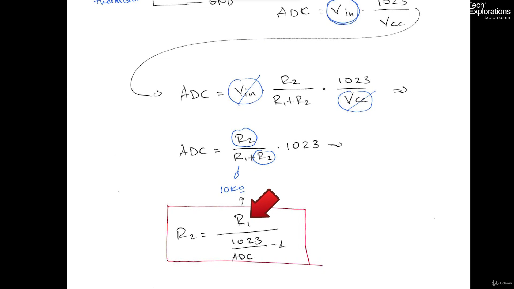
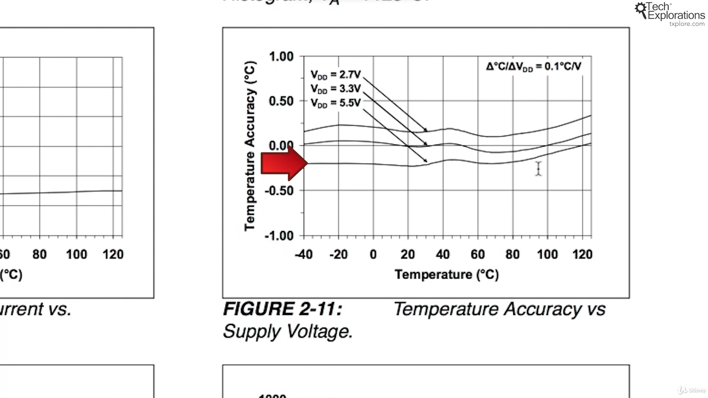

93. [Introduction to environment sensors](#93)
94. [Using a DHT22 sensor to measure temperature and humidity](#94)
95. [An introduction to the Thermistor](#95)
96. [Wiring the Thermistor](#96)
97. [How to calculate the temperature from the thermistor resistance](#97)
98. [Thermistor: getting a temperature using a library](#98)
99. [Thermistor: improving the accuracy of analog readings with AREF](#99)
100.  [An introduction to measuring temperature with the TMP36](#100)
101.  [Wiring the TMP36 and a demonstration sketch](#101)
102.  [An alternate wiring of the TMP36](#102)
103.  [An introduction to the MCP9808 for very accurate temperature readings](#103)
104.  [MCP9808: Wiring](#104)
105.  [Using the MCP9808, demo and sketch walkthrough](#105)
106.  [MCP9808: A closer look at I2C addressing](#106)
107.  [An introduction to measuring barometric pressure with the BMP180](#107)
108.  [Wiring the BMP180 and first sketch walkthrough](#108)
109.  [A first demo sketch for the BMP180](#109)
110.  [A second demo sketch for the BMP180](#110)

---

### 93. Introduction to environment sensors<a id="93"></a>

### 94. Using a DHT22 sensor to measure temperature and humidity<a id="94"></a>


#### Schematic


#### Output


```ino
/*  DHT22/11 temerature and humidity sensor demonstration sketch
 *
 * This sketch reads the temperature and humidity from a DHT sensor.
 *
 * This is a common digital sensor which is calibrated in factory
 * and outputs true values so that no further calculations are needed
 * on the Arduino.

 *
 * This sketch was adapted for Arduino Step by Step by Peter Dalmaris from the
 * demo sketch that ships with the Adafruit library.
 *
 * Components
 * ----------
 *  - Arduino Uno
 *  - A DHT22 or DHT11 sensor
 *  - 10 kOhm resistor to pull up the data pin
 *
 *  Libraries
 *  ---------
 *  DHT.h
 *
 * Connections
 * -----------
 *
 * Hold the sensor so that the grill is towards you. Here are the connections
 *
 *     -----------
 *     | - |  -  |
 *     | - |  -  |
 *     | - |  -  |
 *     | - |  -  |
 *     -----------
 *     |  |  |  |
 *     |  |  |  |
 *     |  |  |  |
 *     |  |  |  |
 *    5V  2     GND
 *      data
 *
 * Connect a 10KOhm resistor between the 5V and data pin (2)
 *
 * Other information
 * -----------------
 *
 * DHT22 datasheet: https://www.sparkfun.com/datasheets/Sensors/Temperature/DHT22.pdf
 * The Github repository for the library: https://github.com/adafruit/DHT-sensor-library
 * The DHT library requires Adafruit's Unified Sensor Driver. Install that by searching
 * for "Adafruit Unified Sensor" in the Library Manager.
 * Learn more about the Unified Driver: https://github.com/adafruit/Adafruit_Sensor
 * About the Heat Index:
 * About pull up and pull down resistors:
 *
 *
 *
 *  Created on October 11 2016 by Peter Dalmaris
 *
 */

// Example testing sketch for various DHT humidity/temperature sensors
// Written by ladyada, public domain

#include "DHT.h"

#define DHTPIN 2     // what digital pin we're connected to

// Uncomment whatever type you're using!
//#define DHTTYPE DHT11   // DHT 11
#define DHTTYPE DHT22   // DHT 22  (AM2302), AM2321
//#define DHTTYPE DHT21   // DHT 21 (AM2301)

// Initialize DHT sensor.
// Note that older versions of this library took an optional third parameter to
// tweak the timings for faster processors.  This parameter is no longer needed
// as the current DHT reading algorithm adjusts itself to work on faster procs.
DHT dht(DHTPIN, DHTTYPE);

void setup() {
  Serial.begin(9600);
  Serial.println("DHTxx test!");

  dht.begin();
}

void loop() {
  // Wait a few seconds between measurements.
  delay(2000);

  // Reading temperature or humidity takes about 250 milliseconds!
  // Sensor readings may also be up to 2 seconds 'old' (its a very slow sensor)
  float h = dht.readHumidity();
  // Read temperature as Celsius (the default)
  float t = dht.readTemperature();
  // Read temperature as Fahrenheit (isFahrenheit = true)
  float f = dht.readTemperature(true);

  // Check if any reads failed and exit early (to try again).
  if (isnan(h) || isnan(t) || isnan(f)) {
    Serial.println("Failed to read from DHT sensor!");
    return;
  }

  // Compute heat index in Fahrenheit (the default)
  float hif = dht.computeHeatIndex(f, h);
  // Compute heat index in Celsius (isFahreheit = false)
  float hic = dht.computeHeatIndex(t, h, false);

  Serial.print("Humidity: ");
  Serial.print(h);
  Serial.print(" %\t");
  Serial.print("Temperature: ");
  Serial.print(t);
  Serial.print(" *C ");
  Serial.print(f);
  Serial.print(" *F\t");
  Serial.print("Heat index: ");
  Serial.print(hic);
  Serial.print(" *C ");
  Serial.print(hif);
  Serial.println(" *F");
}
```

- DHT22 also named as AM2302, humidity & temperature sensor datasheet [click me](https://www.sparkfun.com/datasheets/Sensors/Temperature/DHT22.pdf)
- Wiki humidity concept [click me](https://en.wikipedia.org/wiki/Humidity#Relative_humidity)
- Wiki heat index concept [click me](https://en.wikipedia.org/wiki/Heat_index)
- Techexploration pull-up & pull-down concept [click me](https://techexplorations.com/guides/arduino/common-circuits/pull-up-and-pull-down-resistors/)
- github DHT22 library [click me](https://github.com/adafruit/DHT-sensor-library)

### 95. An introduction to the Thermistor<a id="95"></a>

#### How to check if thermistor is NTC or PTC


- Set multimeter to check resistance connect with two terminal of thermistor
- now put finger around thermistor and check resistance
- case1: if resistance drop from room temp then NTC
- case2: if resistance increase from room temp then PTC
- The thermistor is an analog sensor, its resistance changes as temperature changes

- Wiki Thermistor concept [click me](https://en.wikipedia.org/wiki/Thermistor)

Note-

- Most of the sensor work on measuring resistance they all are transducer that change physical value to electrical value
- Means if i could create a device that change resistance depending of external changes like temperature, humidity, CO2, etc then i can apply ADC converter a formula to get correct reading

### 96. Wiring the Thermistor<a id="96"></a>

#### 5v schematic


#### 3.3v schematic


#### Output


```ino
/*  Thermistor temperature sensor demonstration sketch
 *
 * This sketch calculates the the resistane of a
 * thermistor connected in a voltage divider circuit.
 *
 * This sketch was written for Arduino Step by Step by Peter Dalmaris.
 *
 * Components
 * ----------
 *  - Arduino Uno
 *  - thermistor temperature sensor
 *  - 10 kOhm resistor
 *
 *  Libraries
 *  ---------
 *  Thermistor.h
 *
 * Connections
 * -----------
 *
 * Connect the Arduino 5V pin to one end of the
 * thermistor. Connect the resistor to the Arduino GND
 * pin. Connect the free pins on the thermistor and
 * resistor together. Connect the thermistor and resistor
 * junction to the Arduino analog pin 0. This
 * structure is called a "voltage divider".
 *                    10 kΩ
 *  5V -----OOO------\/\/\/-----GND
 *                |
 *                |
 *                |
 *                A0
 *
 *
 * Other information
 * -----------------
 *
 * About the termistor: https://en.wikipedia.org/wiki/Thermistor
 * The Github repository for the library: https://github.com/panStamp/thermistor
 *
 *
 *
 *  Created on October 8 2016 by Peter Dalmaris
 *
 */

// the value of the 'other' resistor. I am using a 10 KOhm resistor.
#define SERIESRESISTOR 9950

// What pin to connect the sensor to
#define THERMISTORPIN A0

void setup(void) {
  Serial.begin(9600);
}

void loop(void) {
  float reading;

  reading = analogRead(THERMISTORPIN);

  Serial.print("Analog reading ");
  Serial.println(reading);

  // convert the value to resistance
  reading = (1023 / reading)  - 1;
  reading = SERIESRESISTOR / reading;
  Serial.print("Thermistor resistance ");
  Serial.println(reading);

  delay(1000);
}
```

- Linear equation math calculator [click me](https://doodlelearning.com/us/math-app)

### 97. How to calculate the temperature from the thermistor resistance<a id="97"></a>




### 98. Thermistor: getting a temperature using a library<a id="98"></a>

#### Output


```ino
/*  Thermistor temperature sensor demonstration sketch
 *
 * This sketch calculates the the temperature by reading the voltage of a
 * thermistor connected in a voltage divider circuit.
 *
 * It then does a caclulation to convert this raw reading into a temperature.
 *
 * This sketch was adapted for Arduino Step by Step by Peter Dalmaris from the
 * demo sketch that ships with the library, written by Daniel Berenguer.
 *
 * Components
 * ----------
 *  - Arduino Uno
 *  - thermistor temperature sensor
 *  - 10 kOhm resistor
 *
 *  Libraries
 *  ---------
 *  Thermistor.h
 *
 * Connections
 * -----------
 *
 * Connect the Arduino 5V pin to one end of the
 * thermistor. Connect the resistor to the Arduino GND
 * pin. Connect the free pins on the thermistor and
 * resistor together. Connect the thermistor and resistor
 * junction to the Arduino analog pin 0. This
 * structure is called a "voltage divider".
 *                    10 kΩ
 *  5V -----OOO------\/\/\/-----GND
 *                |
 *                |
 *                |
 *                A0
 *
 *
 * Other information
 * -----------------
 *
 * About the termistor: https://en.wikipedia.org/wiki/Thermistor
 * The Github repository for the library: https://github.com/panStamp/thermistor
 *
 *
 *
 *  Created on October 8 2016 by Peter Dalmaris
 *
 */

/**
 * Copyright (c) 2015 panStamp S.L.U. <contact@panstamp.com>
 *
 * This file is part of the panStamp project.
 *
 * panStamp  is free software; you can redistribute it and/or modify
 * it under the terms of the GNU General Public License as published by
 * the Free Software Foundation; either version 2 of the License, or
 * (at your option) any later version.
 *
 * panStamp is distributed in the hope that it will be useful,
 * but WITHOUT ANY WARRANTY; without even the implied warranty of
 * MERCHANTABILITY or FITNESS FOR A PARTICULAR PURPOSE. See the
 * GNU General Public License for more details.
 *
 * You should have received a copy of the GNU General Public License
 * along with panStamp; if not, write to the Free Software
 * Foundation, Inc., 51 Franklin St, Fifth Floor, Boston, MA  02110-1301
 * USA
 *
 * Author: Daniel Berenguer
 * Creation date: 06/24/2015
 */

#include "thermistor.h"

// Analog pin used to read the NTC
#define NTC_PIN               A0

// Thermistor object
THERMISTOR thermistor(NTC_PIN,        // Analog pin
                      7500,          // Nominal resistance at 25 ºC
                      3950,           // thermistor's beta coefficient
                      9950);         // Value of the series resistor

// Global temperature reading
uint16_t temp;

/**
 * setup
 *
 * Arduino setup function
 */
void setup()
{
  Serial.begin(9600);
}

/**
 * loop
 *
 * Arduino main loop
 */
void loop()
{
  temp = thermistor.read();   // Read temperature

  Serial.print("Temp in 1/10 ºC : ");
  Serial.println(temp);

  delay(5000);
}

```

- github thermistor library [click me](https://github.com/panStamp/thermistor)

### 99. Thermistor: improving the accuracy of analog readings with AREF<a id="99"></a>


```ino
/*  Thermistor temperature sensor demonstration sketch
 *
 * This sketch calculates the the temperature by reading the voltage of a
 * thermistor connected in a voltage divider circuit.
 *
 * It then does a caclulation to convert this raw reading into a temperature.
 *
 * This sketch was adapted for Arduino Step by Step by Peter Dalmaris from the
 * demo sketch that ships with the library, written by Daniel Berenguer.
 *
 * Components
 * ----------
 *  - Arduino Uno
 *  - thermistor temperature sensor
 *  - 10 kOhm resistor
 *
 *  Libraries
 *  ---------
 *  Thermistor.h
 *
 * Connections
 * -----------
 *
 * Connect the Arduino 5V pin to one end of the
 * thermistor. Connect the resistor to the Arduino GND
 * pin. Connect the free pins on the thermistor and
 * resistor together. Connect the thermistor and resistor
 * junction to the Arduino analog pin 0. This
 * structure is called a "voltage divider".
 *                    10 kΩ
 *  5V -----OOO------\/\/\/-----GND
 *                |
 *                |
 *                |
 *                A0
 *
 *
 * Other information
 * -----------------
 *
 * About the termistor: https://en.wikipedia.org/wiki/Thermistor
 * The Github repository for the library: https://github.com/panStamp/thermistor
 *
 *
 *
 *  Created on October 8 2016 by Peter Dalmaris
 *
 */

/**
 * Copyright (c) 2015 panStamp S.L.U. <contact@panstamp.com>
 *
 * This file is part of the panStamp project.
 *
 * panStamp  is free software; you can redistribute it and/or modify
 * it under the terms of the GNU General Public License as published by
 * the Free Software Foundation; either version 2 of the License, or
 * (at your option) any later version.
 *
 * panStamp is distributed in the hope that it will be useful,
 * but WITHOUT ANY WARRANTY; without even the implied warranty of
 * MERCHANTABILITY or FITNESS FOR A PARTICULAR PURPOSE. See the
 * GNU General Public License for more details.
 *
 * You should have received a copy of the GNU General Public License
 * along with panStamp; if not, write to the Free Software
 * Foundation, Inc., 51 Franklin St, Fifth Floor, Boston, MA  02110-1301
 * USA
 *
 * Author: Daniel Berenguer
 * Creation date: 06/24/2015
 */

#include "thermistor.h"

// Analog pin used to read the NTC
#define NTC_PIN               A0

// Thermistor object
THERMISTOR thermistor(NTC_PIN,        // Analog pin
                      7500,          // Nominal resistance at 25 ºC
                      3950,           // thermistor's beta coefficient
                      9950);         // Value of the series resistor

// Global temperature reading
uint16_t temp;

/**
 * setup
 *
 * Arduino setup function
 */
void setup()
{
  Serial.begin(9600);
}

/**
 * loop
 *
 * Arduino main loop
 */
void loop()
{
  temp = thermistor.read();   // Read temperature

  Serial.print("Temp in 1/10 ºC : ");
  Serial.println(temp);

  delay(5000);
}

```

- With 3.3v and aref pin we can get clear reading as it more accurate than 5v pin

### 100. An introduction to measuring temperature with the TMP36<a id="100"></a>


- TMP36 analog temperature sensor datasheet [click me](https://www.analog.com/media/en/technical-documentation/data-sheets/TMP35_36_37.pdf)
- Wiki Linear equation concept [click me](https://en.wikipedia.org/wiki/Linear_equation)

### 101. Wiring the TMP36 and a demonstration sketch<a id="101"></a>

#### TMP36 5v schematic configuration


#### TMP36 3.3v schematic configuration


#### Output


```ino
/*  TMP36 temperature sensor demonstration sketch
 *
 * This sketch reads the the voltage of the TMP36 sensor output pin.
 * It then does a caclulation to convert this raw reading into a temperature.
 *
 * This sketch was written for Arduino Step by Step by Peter Dalmaris.
 *
 * Components
 * ----------
 *  - Arduino Uno
 *  - TMP36 temperature sensor
 *
 *  Libraries
 *  ---------
 *  NONE
 *
 * Connections
 * -----------
 *
 * As you look at the sensor with the label facing you, the left most pin is #1
 *
 *  Break out    |    Arduino Uno
 *  -----------------------------
 *      1        |         5V
 *      2        |         A0
 *      3        |         GND
 *
 *
 * Other information
 * -----------------
 *
 * Datasheet: http://www.analog.com/media/en/technical-documentation/data-sheets/TMP35_36_37.pdf
 *
 *  Created on October 8 2016 by Peter Dalmaris
 *
 */

int sensorPin = 0; // The reading is obtained from analog pin 0 (A0)
float supply_voltage = 5; // 3.3; //If you are useing a 3.3V supply voltage, change this accordingly.
                          // If you are using the 3.3V supply also uncomment line 44.
                          // If you are using the 5V supply, use the value "5" here.

void setup()
{
 // analogReference(EXTERNAL); // If using 3.3V as reference by bridging it to the AREF pin,
                               // then uncomment this line. If using 5V then this is not necessary.
  Serial.begin(9600);  // Start the serial connection with the computer
                       // to view the result open the serial monitor
}

void loop()
{
 //getting the voltage reading from the temperature sensor
 int reading = analogRead(sensorPin);

 // converting that reading to voltage, for 3.3v arduino use 3.3
 float voltage = reading * supply_voltage / 1024;

 // print out the voltage
 Serial.print(voltage); Serial.println(" volts");

 // now print out the temperature
 float temperatureC = (voltage - 0.5) * 100 ;  //converting from 10 mv per degree with 500 mV offset
                                               //to degrees ((voltage - 500mV) times 100)
 Serial.print(temperatureC); Serial.println(" degrees C");

 // now convert to Fahrenheit
 float temperatureF = (temperatureC * 9.0 / 5.0) + 32.0;
 Serial.print(temperatureF); Serial.println(" degrees F");

 delay(1000);                                     //waiting a second
}
```

### 102. An alternate wiring of the TMP36<a id="102"></a>

#### TMP36 3.3v schematic configuration


#### Why we should use 3.3v and how to tell arduino about it so it sample from 0-1023 instead 0-600


- We are using 3.3v supply for temp sensor because the 3.3v has its on voltage regulator and filter capacitor on arduino board which provide smooth signal
- As we draw voltage from laptop to arduino board that voltage is moving to other traces and same voltage we use to sensor, the signal has noise
- But whenever we use 3.3 voltage for sensor we have to tell arduino that we are using 3.3v pin to do that we use jumper wire to connect pin Aref(analog reference)
- If we wont connect aref pin using jumper wire in 3.3v volt the arduino max voltage changes to 3.3v but ADC have value from 0-600 sample instead of 0-1023

#### output


```ino
/*  TMP36 temperature sensor demonstration sketch
 *
 * This sketch reads the the voltage of the TMP36 sensor output pin.
 * It then does a caclulation to convert this raw reading into a temperature.
 *
 * This sketch was written for Arduino Step by Step by Peter Dalmaris.
 *
 * Components
 * ----------
 *  - Arduino Uno
 *  - TMP36 temperature sensor
 *
 *  Libraries
 *  ---------
 *  NONE
 *
 * Connections
 * -----------
 *
 * As you look at the sensor with the label facing you, the left most pin is #1
 *
 *  Break out    |    Arduino Uno
 *  -----------------------------
 *      1        |         5V
 *      2        |         A0
 *      3        |         GND
 *
 *
 * Other information
 * -----------------
 *
 * Datasheet: http://www.analog.com/media/en/technical-documentation/data-sheets/TMP35_36_37.pdf
 *
 *  Created on October 8 2016 by Peter Dalmaris
 *
 */

int sensorPin = 0; // The reading is obtained from analog pin 0 (A0)
float supply_voltage = 3.3; // 3.3; //If you are useing a 3.3V supply voltage, change this accordingly.
                          // If you are using the 3.3V supply also uncomment line 44.
                          // If you are using the 5V supply, use the value "5" here.

void setup()
{
 analogReference(EXTERNAL); // If using 3.3V as reference by bridging it to the AREF pin,
                               // then uncomment this line. If using 5V then this is not necessary.
  Serial.begin(9600);  // Start the serial connection with the computer
                       // to view the result open the serial monitor
}

void loop()
{
 //getting the voltage reading from the temperature sensor
 int reading = analogRead(sensorPin);

 // converting that reading to voltage, for 3.3v arduino use 3.3
 float voltage = reading * supply_voltage / 1024;

 // print out the voltage
 Serial.print(voltage); Serial.println(" volts");

 // now print out the temperature
 float temperatureC = (voltage - 0.5) * 100 ;  //converting from 10 mv per degree with 500 mV offset
                                               //to degrees ((voltage - 500mV) times 100)
 Serial.print(temperatureC); Serial.println(" degrees C");

 // now convert to Fahrenheit
 float temperatureF = (temperatureC * 9.0 / 5.0) + 32.0;
 Serial.print(temperatureF); Serial.println(" degrees F");

 delay(1000);                                     //waiting a second
}
```

### 103. An introduction to the MCP9808 for very accurate temperature readings<a id="103"></a>





- MCP9808 Maximum Accuracy Digital Temperature Sensor datasheet [click me](https://ww1.microchip.com/downloads/en/DeviceDoc/25095A.pdf>)
- github MCP9808 Digital Temperature Sensor library [click me](https://github.com/adafruit/Adafruit_MCP9808_Library)

### 104. MCP9808: Wiring<a id="104"></a>

Schematic


### 105. Using the MCP9808, demo and sketch walkthrough<a id="105"></a>

#### Output


```ino
/*  Temperature MCP9808 sensor demo sketch
 *
 * This sketch reads the temperature from the MCP9808 precision sensor
 * on the Adafruit TCS34725 (or equivelant) breakout module.
 *
 * This sketch was adapted from the original that comes with the
 * Adafruit library for Arduino Step by Step by Peter Dalmaris.
 *
 * Components
 * ----------
 *  - Arduino Uno
 *  - Adafruit MCP9808 breakout module (or equivelant)
 *
 *  Libraries
 *  ---------
 *  - Wire
 *  - Adafruit_MCP9808
 *
 * Connections
 * -----------
 *  Break out    |    Arduino Uno
 *  -----------------------------
 *      VIN      |      5V
 *      GND      |      GND
 *      SCL      |      SCL or A5
 *      SDA      |      SDA or A4

 *
 * Other information
 * -----------------
 *  There are three pads on the sensor breakout that can be used
 *  to change the I2C address.
 *  MCP9808 datasheet: http://ww1.microchip.com/downloads/en/DeviceDoc/25095A.pdf
 *  Adafruit product page: https://www.adafruit.com/product/1782
 *  Adafruit library on Github: https://github.com/adafruit/Adafruit_MCP9808_Library
 *
 *  Created on October 8 2016 by Peter Dalmaris
 *
 */

/**************************************************************************/
/*!
This is a demo for the Adafruit MCP9808 breakout
----> http://www.adafruit.com/products/1782
Adafruit invests time and resources providing this open source code,
please support Adafruit and open-source hardware by purchasing
products from Adafruit!
*/
/**************************************************************************/

#include <Wire.h>
#include "Adafruit_MCP9808.h"

// Create the MCP9808 temperature sensor object
Adafruit_MCP9808 tempsensor = Adafruit_MCP9808();

void setup() {
  Serial.begin(9600);
  Serial.println("MCP9808 demo");

  // Make sure the sensor is found, you can also pass in a different i2c
  // address with tempsensor.begin(0x19) for example
  if (!tempsensor.begin(0x19)) {
    Serial.println("Couldn't find MCP9808!");
    while (1);
  }
}

void loop() {
  // Read and print out the temperature, then convert to *F
  float c = tempsensor.readTempC();
  float f = c * 9.0 / 5.0 + 32;
  Serial.print("Temp: "); Serial.print(c); Serial.print("*C\t");
  Serial.print(f); Serial.println("*F");
  delay(250);

  Serial.println("Shutdown MCP9808.... ");
  tempsensor.shutdown_wake(1); // shutdown MSP9808 - power consumption ~0.1 mikro Ampere

  delay(2000);

  Serial.println("wake up MCP9808.... "); // wake up MSP9808 - power consumption ~200 mikro Ampere
  tempsensor.shutdown_wake(0);


}
```

### 106. MCP9808: A closer look at I2C addressing<a id="106"></a>

#### Datasheet custom I2C address


#### Adding Vcc to A0 using jumper for new address


#### Modifying IC2 address in temperature sensor sketch


---

#### How to get scan address of any I2C device

```ino
// --------------------------------------
// i2c_scanner
//
// Version 1
//    This program (or code that looks like it)
//    can be found in many places.
//    For example on the Arduino.cc forum.
//    The original author is not know.
// Version 2, Juni 2012, Using Arduino 1.0.1
//     Adapted to be as simple as possible by Arduino.cc user Krodal
// Version 3, Feb 26  2013
//    V3 by louarnold
// Version 4, March 3, 2013, Using Arduino 1.0.3
//    by Arduino.cc user Krodal.
//    Changes by louarnold removed.
//    Scanning addresses changed from 0...127 to 1...119,
//    according to the i2c scanner by Nick Gammon
//    http://www.gammon.com.au/forum/?id=10896
// Version 5, March 28, 2013
//    As version 4, but address scans now to 127.
//    A sensor seems to use address 120.
// Version 6, November 27, 2015.
//    Added waiting for the Leonardo serial communication.
//
//
// This sketch tests the standard 7-bit addresses
// Devices with higher bit address might not be seen properly.
//

#include <Wire.h>


void setup()
{
  Wire.begin();

  Serial.begin(9600);
  while (!Serial);             // Leonardo: wait for serial monitor
  Serial.println("\nI2C Scanner");
}


void loop()
{
  byte error, address;
  int nDevices;

  Serial.println("Scanning...");

  nDevices = 0;
  for(address = 1; address < 127; address++ )
  {
    // The i2c_scanner uses the return value of
    // the Write.endTransmisstion to see if
    // a device did acknowledge to the address.
    Wire.beginTransmission(address);
    error = Wire.endTransmission();

    if (error == 0)
    {
      Serial.print("I2C device found at address 0x");
      if (address<16)
        Serial.print("0");
      Serial.print(address,HEX);
      Serial.println("  !");

      nDevices++;
    }
    else if (error==4)
    {
      Serial.print("Unknow error at address 0x");
      if (address<16)
        Serial.print("0");
      Serial.println(address,HEX);
    }
  }
  if (nDevices == 0)
    Serial.println("No I2C devices found\n");
  else
    Serial.println("done\n");

  delay(5000);           // wait 5 seconds for next scan
}
```


- Binary to hex converter [click me](https://www.binaryhexconverter.com/binary-to-hex-converter)

### 107. An introduction to measuring barometric pressure with the BMP180<a id="107"></a>

### 108. Wiring the BMP180 and first sketch walkthrough<a id="108"></a>

### 109. A first demo sketch for the BMP180<a id="109"></a>

### 110. A second demo sketch for the BMP180<a id="110"></a>


- Ardunio uno r3 documentation #define [click me](https://www.arduino.cc/reference/en/language/structure/further-syntax/define/)
- Wiki Gamma correction concept [click me](<https://en.wikipedia.org/wiki/Gamma_correction>)
