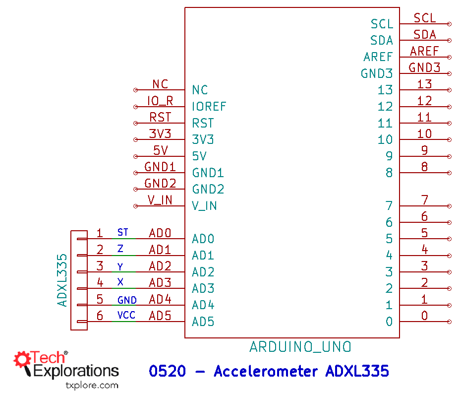
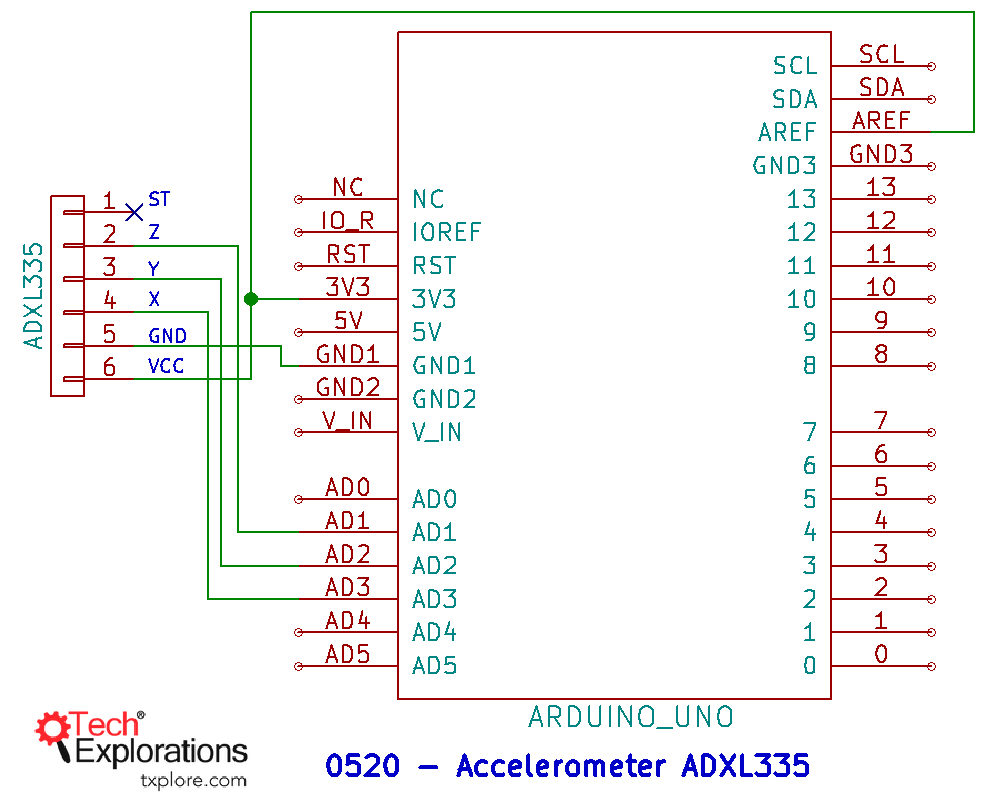

111. [Introduction to detecting acceleration](#111)
112. [Introduction to detecting acceleration with the ADXL335](#112)
113. [Wiring the ADXL335](#113)
114. [Plugging the ADXL335 directly in the Arduino, and detect its orientation](#114)
115. [Write the sketch for detecting orientation with the ADXL335](#115)

---

### 111. Introduction to detecting acceleration

### 112. Introduction to detecting acceleration with the ADXL335

#### wiring schematic

#### 3.3V wiring schematic

- ADXL335 Accelerometer sensor datasheet [click me](https://www.analog.com/media/en/technical-documentation/data-sheets/ADXL335.pdf)
- Wiki Voltage regulator topic [click me](https://en.wikipedia.org/wiki/Voltage_regulator)

### 113. Wiring the ADXL335

### 114. Plugging the ADXL335 directly in the Arduino, and detect its orientation

### 115. Write the sketch for detecting orientation with the ADXL335

- github Adafruit_BMP085_Unified [click me](Adafruit_BMP085_Unified)
- Ardunio uno r3 documentation #define [click me](https://www.arduino.cc/reference/en/language/structure/further-syntax/define/)
- Wiki Gamma correction concept [click me](https://en.wikipedia.org/wiki/Gamma_correction)
- BMP180 digital pressure sensor datasheet [click me](https://www.digikey.com/htmldatasheets/production/856385/0/0/1/bmp180-datasheet.html)
