111. [Introduction to detecting acceleration](#111)
112. [Introduction to detecting acceleration with the ADXL335](#112)
113. [Wiring the ADXL335](#113)
114. [Plugging the ADXL335 directly in the Arduino, and detect its orientation](#114)
115. [Write the sketch for detecting orientation with the ADXL335](#115)

---

### 111. Introduction to detecting acceleration<a id="111"></a>

- ADXL335 acclerometer give analog voltage output
- Sensor: An Measuring instrument/device

### 112. Introduction to detecting acceleration with the ADXL335<a id="112"></a>

- ADXL335 Accelerometer sensor datasheet [click me](https://www.analog.com/media/en/technical-documentation/data-sheets/ADXL335.pdf)
- Wiki Voltage regulator topic [click me](https://en.wikipedia.org/wiki/Voltage_regulator)

### 113. Wiring the ADXL335<a id="113"></a>

#### 3.3V wiring schematic


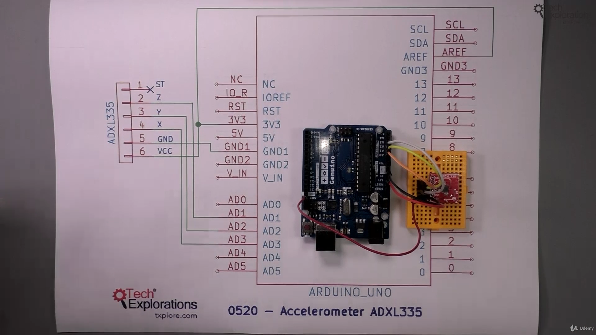

#### Output

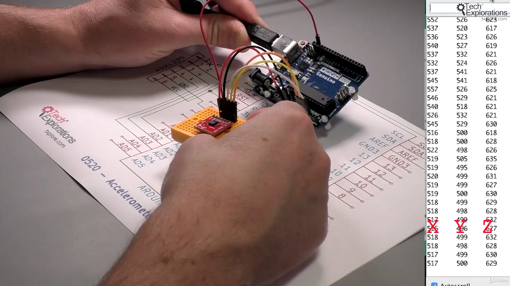

```ino
/*  ADXL335 3-axis acceleration sensor demo sketch 1
 *
 * This sketch gets raw X-Y-Z acceleration readings from the
 * ADXL335 sensor.
 *
 * The readings come from any 3 available analog inputs, but in this
 * sketch we will use A3, A2 and A1.
 *
 * Notice that the breakout only works at 3.3V voltage level. Therefore,
 * connect Vcc to the Arduino's 3.3V pin. To ensure that the Arduino analog
 * inputs are sampled at that level, connect the breakout VCC to the
 * Arduino HREF pin.
 *
 * This sketch was written for Arduino Step by Step by Peter Dalmaris.
 *
 * Components
 * ----------
 *  - Arduino Uno
 *  - ADXL335 sensor breakout or equivelant
 *
 *  Libraries
 *  ---------
 *  - NONE
 *
 * Connections
 * -----------
 *  Break out    |    Arduino Uno
 *  -----------------------------
 *      VCC      |      3.3V
 *      GND      |      GND
 *      X        |      A3
 *      Y        |      A2
 *      Z        |      A1
 *      VCC      |      AREF  This will ensure that the Arduino uses 0-3.3V as the sampling range
 *
 *      You can also simply plug the ADXL335 breakout directly onto the analog pins header,
 *      orienting it so that the axis pins plug into the header as per the connections table above.
 *      If you do the connection this way, then Vcc will be connected to A5 and GND to A4. Remember to
 *      uncomment the relevant lines in the setup function in order to properly power the sensor.

 *
 * Other information
 * -----------------
 *  For information on acceleration: https://en.wikipedia.org/wiki/Acceleration
 *  ADXL335 datasheet: http://www.analog.com/media/en/technical-documentation/data-sheets/ADXL335.pdf
 *
 *  As per the datasheet, the sensitivity of the sensor is ~300mV/g at 3V. We can use this information
 *  to convert the analog reading into G-force reading (not implemented in this sketch).
 *
 *  Created on October 8 2016 by Peter Dalmaris
 *
 */


int X_axis = A3;
int Y_axis = A2;
int Z_axis = A1;

const int groundpin = 18;             // analog input pin 4 -- ground
                                      // Analog pins can be treated as digital pins.
                                      // Analog pin 4 corresponds to digital pin 18.
const int powerpin = 19;              // analog input pin 5 -- voltage
                                      // Analog pin 5 corresponds to digital pin 19

int x, y, z;                          // These variables will hold the raw sensor values.

void setup()
{
  //analogReference(EXTERNAL); // This configures the analog to digital converter so that it
                               // uses the AREF voltage. If you have connected the 3.3V
                               // pin to the AREF pin on the Arduino, then the AREF voltage is 3.3V.
                               // If you have pluged the breakout directly into the analog header
                               // leave analogReference commented out.

  // Provide ground and power by using the analog inputs as normal
  // digital pins.  This makes it possible to directly connect the
  // breakout board to the Arduino.  If you use the normal 5V and
  // GND pins on the Arduino, you can remove these lines.
  pinMode(groundpin, OUTPUT);
  pinMode(powerpin, OUTPUT);
  digitalWrite(groundpin, LOW);
  digitalWrite(powerpin, HIGH);

  Serial.begin(9600);      // sets the serial port to 9600

  delay(1000);
}

void loop()
{
  x = analogRead(X_axis);       // read analog input pin 0
  y = analogRead(Y_axis);       // read analog input pin 1
  z = analogRead(Z_axis);       // read analog input pin 1

  Serial.print(x);              // print the raw value in the X axis
  Serial.print("\t");           // prints a tab between the numbers
  Serial.print(y);              // print the raw value in the Y axis
  Serial.print("\t");           // prints a tab between the numbers
  Serial.print(z);              // print the raw value in the Z axis
  Serial.println();

  delay(100);              // wait 100ms for next reading
}
```

Note-

- The Aref pin is used for analog reference voltage, the maximum aref voltage is 5v.
- we can pass any aref voltage between 0-5v, to tell micro controller we are using certain voltage, take it as maximum voltage and set sampling 0-1023

### 114. Plugging the ADXL335 directly in the Arduino, and detect its orientation<a id="114"></a>

#### 5v wiring directly from A5, A4

wiring schematic


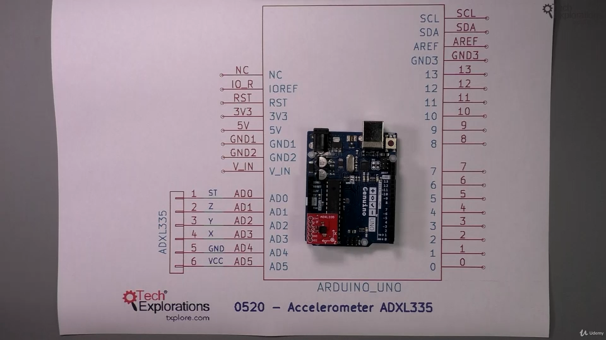

#### Output

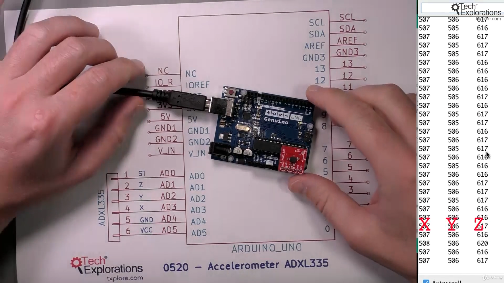

```ino
/*  ADXL335 3-axis acceleration sensor demo sketch 1
 *
 * This sketch gets raw X-Y-Z acceleration readings from the
 * ADXL335 sensor.
 *
 * The readings come from any 3 available analog inputs, but in this
 * sketch we will use A3, A2 and A1.
 *
 * Notice that the breakout only works at 3.3V voltage level. Therefore,
 * connect Vcc to the Arduino's 3.3V pin. To ensure that the Arduino analog
 * inputs are sampled at that level, connect the breakout VCC to the
 * Arduino HREF pin.
 *
 * This sketch was written for Arduino Step by Step by Peter Dalmaris.
 *
 * Components
 * ----------
 *  - Arduino Uno
 *  - ADXL335 sensor breakout or equivelant
 *
 *  Libraries
 *  ---------
 *  - NONE
 *
 * Connections
 * -----------
 *  Break out    |    Arduino Uno
 *  -----------------------------
 *      VCC      |      3.3V
 *      GND      |      GND
 *      X        |      A3
 *      Y        |      A2
 *      Z        |      A1
 *      VCC      |      AREF  This will ensure that the Arduino uses 0-3.3V as the sampling range
 *
 *      You can also simply plug the ADXL335 breakout directly onto the analog pins header,
 *      orienting it so that the axis pins plug into the header as per the connections table above.
 *      If you do the connection this way, then Vcc will be connected to A5 and GND to A4. Remember to
 *      uncomment the relevant lines in the setup function in order to properly power the sensor.

 *
 * Other information
 * -----------------
 *  For information on acceleration: https://en.wikipedia.org/wiki/Acceleration
 *  ADXL335 datasheet: http://www.analog.com/media/en/technical-documentation/data-sheets/ADXL335.pdf
 *
 *  As per the datasheet, the sensitivity of the sensor is ~300mV/g at 3V. We can use this information
 *  to convert the analog reading into G-force reading (not implemented in this sketch).
 *
 *  Created on October 8 2016 by Peter Dalmaris
 *
 */


int X_axis = A3;
int Y_axis = A2;
int Z_axis = A1;

const int groundpin = 18;             // analog input pin 4 -- ground
                                      // Analog pins can be treated as digital pins.
                                      // Analog pin 4 corresponds to digital pin 18.
const int powerpin = 19;              // analog input pin 5 -- voltage
                                      // Analog pin 5 corresponds to digital pin 19

int x, y, z;                          // These variables will hold the raw sensor values.

void setup()
{
  //analogReference(EXTERNAL); // This configures the analog to digital converter so that it
                               // uses the AREF voltage. If you have connected the 3.3V
                               // pin to the AREF pin on the Arduino, then the AREF voltage is 3.3V.
                               // If you have pluged the breakout directly into the analog header
                               // leave analogReference commented out.

  // Provide ground and power by using the analog inputs as normal
  // digital pins.  This makes it possible to directly connect the
  // breakout board to the Arduino.  If you use the normal 5V and
  // GND pins on the Arduino, you can remove these lines.
  pinMode(groundpin, OUTPUT);
  pinMode(powerpin, OUTPUT);
  digitalWrite(groundpin, LOW);
  digitalWrite(powerpin, HIGH);

  Serial.begin(9600);      // sets the serial port to 9600

  delay(1000);
}

void loop()
{
  x = analogRead(X_axis);       // read analog input pin 0
  y = analogRead(Y_axis);       // read analog input pin 1
  z = analogRead(Z_axis);       // read analog input pin 1

  Serial.print(x);              // print the raw value in the X axis
  Serial.print("\t");           // prints a tab between the numbers
  Serial.print(y);              // print the raw value in the Y axis
  Serial.print("\t");           // prints a tab between the numbers
  Serial.print(z);              // print the raw value in the Z axis
  Serial.println();

  delay(100);              // wait 100ms for next reading
}
```

Note-

- We have used Arduino pin A5(19) as 5v(Vcc), and pin A4(18) as Gnd

### 115. Write the sketch for detecting orientation with the ADXL335<a id="115"></a>

#### How to take reading from acclerometer

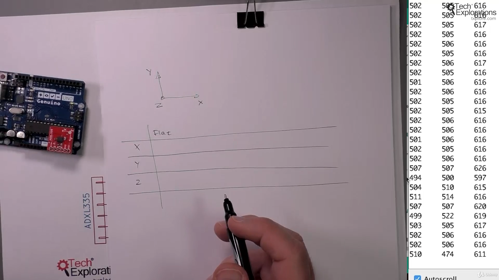

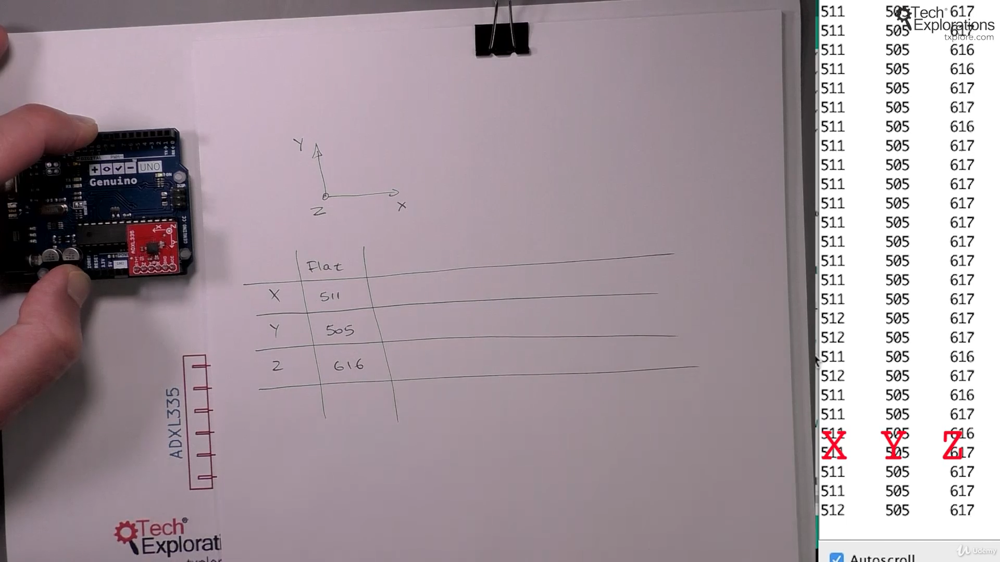

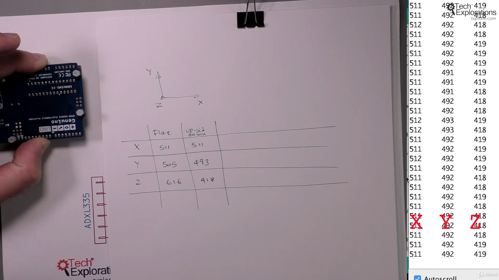

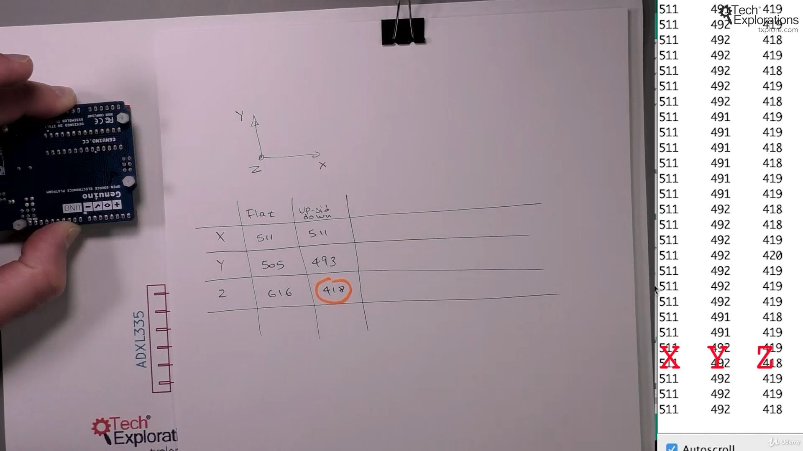

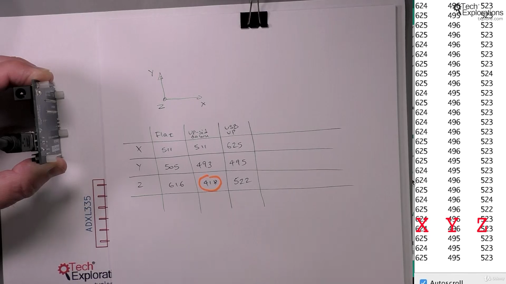

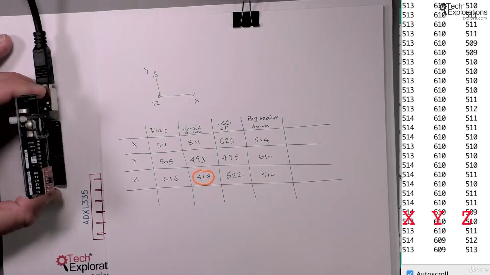

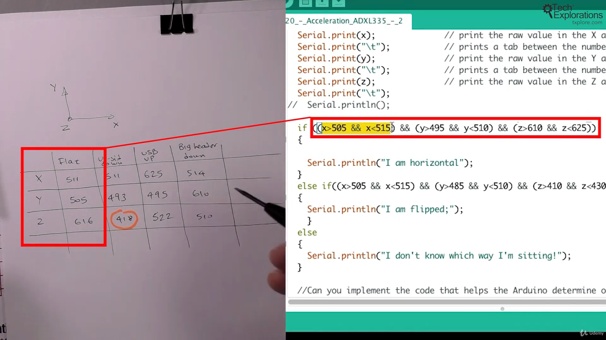

#### Outputs

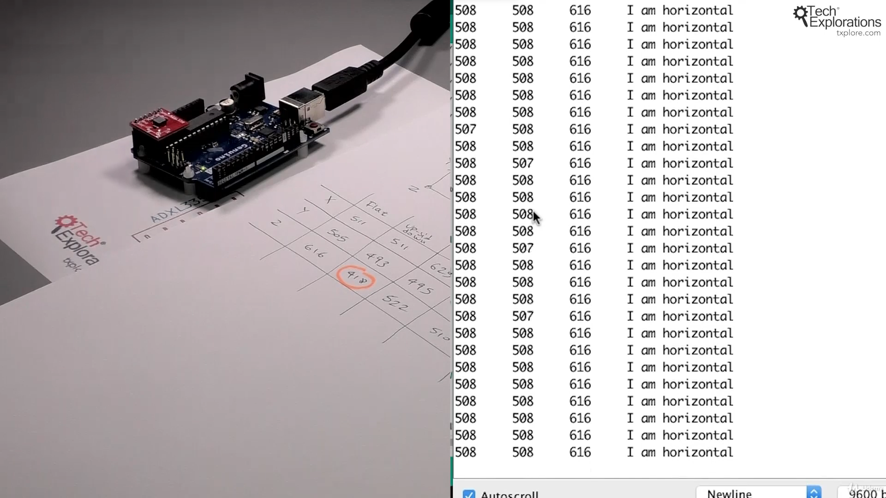

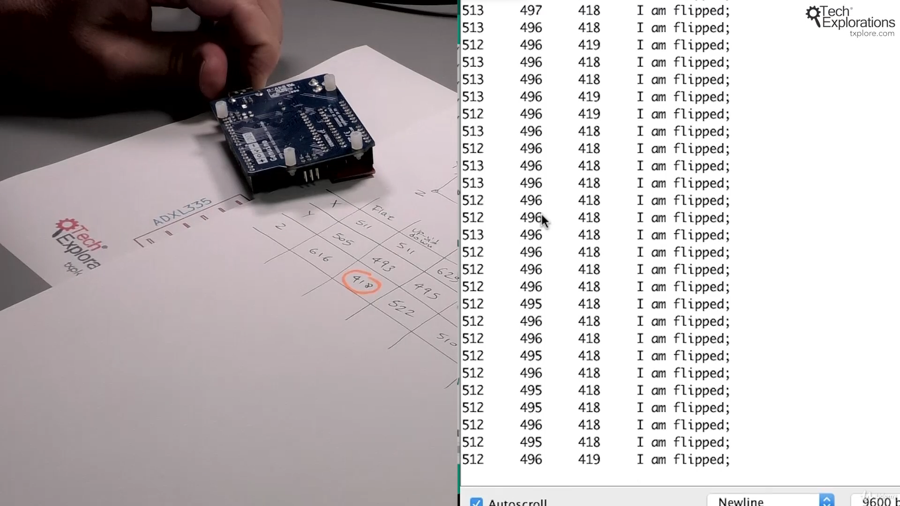

```ino
/*  ADXL335 3-axis acceleration sensor demo sketch 2
 *
 * This sketch gets raw X-Y-Z acceleration readings from the
 * ADXL335 sensor.
 *
 * Then, using those values, the sketch calculates the orientation of the Arduino.
 *
 * The readings come from any 3 available analog inputs, but in this
 * sketch we will use A3, A2 and A1.
 *
 * Notice that the breakout only works at 3.3V voltage level. Therefore,
 * connect Vcc to the Arduino's 3.3V pin. To ensure that the Arduino analog
 * inputs are sampled at that level, connect the breakout VCC to the
 * Arduino HREF pin.
 *
 * This sketch was written for Arduino Step by Step by Peter Dalmaris.
 *
 * Components
 * ----------
 *  - Arduino Uno
 *  - ADXL335 sensor breakout or equivelant
 *
 *  Libraries
 *  ---------
 *  - NONE
 *
 * Connections
 * -----------
 *  Break out    |    Arduino Uno
 *  -----------------------------
 *      VCC      |      3.3V
 *      GND      |      GND
 *      X        |      A3
 *      Y        |      A2
 *      Z        |      A1
 *      VCC      |      AREF  This will ensure that the Arduino uses 0-3.3V as the sampling range
 *
 *      You can also simply plug the ADXL335 breakout directly onto the analog pins header,
 *      orienting it so that the axis pins plug into the header as per the connections table above.
 *      If you do the connection this way, then Vcc will be connected to A5 and GND to A4. Remember to
 *      uncomment the relevant lines in the setup function in order to properly power the sensor.

 *
 * Other information
 * -----------------
 *  For information on acceleration: https://en.wikipedia.org/wiki/Acceleration
 *  ADXL335 datasheet: http://www.analog.com/media/en/technical-documentation/data-sheets/ADXL335.pdf
 *
 *  As per the datasheet, the sensitivity of the sensor is ~300mV/g at 3V. We can use this information
 *  to convert the analog reading into G-force reading (not implemented in this sketch).
 *
 *  Created on October 8 2016 by Peter Dalmaris
 *
 */


int X_axis = A3;
int Y_axis = A2;
int Z_axis = A1;

const int groundpin = 18;             // analog input pin 4 -- ground
                                      // Analog pins can be treated as digital pins.
                                      // Analog pin 4 corresponds to digital pin 18.
const int powerpin = 19;              // analog input pin 5 -- voltage
                                      // Analog pin 5 corresponds to digital pin 19

int x, y, z;                          // These variables will hold the raw sensor values.

void setup()
{
  //analogReference(EXTERNAL); // This configures the analog to digital converter so that it
                               // uses the AREF voltage. If you have connected the 3.3V
                               // pin to the AREF pin on the Arduino, then the AREF voltage is 3.3V.
                               // If you have pluged the breakout directly into the analog header
                               // leave analogReference commented out.

  // Provide ground and power by using the analog inputs as normal
  // digital pins.  This makes it possible to directly connect the
  // breakout board to the Arduino.  If you use the normal 5V and
  // GND pins on the Arduino, you can remove these lines.
  pinMode(groundpin, OUTPUT);
  pinMode(powerpin, OUTPUT);
  digitalWrite(groundpin, LOW);
  digitalWrite(powerpin, HIGH);

  Serial.begin(9600);      // sets the serial port to 9600

  delay(1000);
}

void loop()
{
  x = analogRead(X_axis);       // read analog input pin 0
  y = analogRead(Y_axis);       // read analog input pin 1
  z = analogRead(Z_axis);       // read analog input pin 1

  Serial.print(x);              // print the raw value in the X axis
  Serial.print("\t");           // prints a tab between the numbers
  Serial.print(y);              // print the raw value in the Y axis
  Serial.print("\t");           // prints a tab between the numbers
  Serial.print(z);              // print the raw value in the Z axis
  Serial.print("\t");
//  Serial.println();

// if sensor report the value between for x is 505 to 515 then... same idea for other axis
  if ((x>505 && x<515) && (y>495 && y<510) && (z>610 && z<625))
  {

    Serial.println("I am horizontal");
  }
  else if((x>505 && x<515) && (y>485 && y<510) && (z>410 && z<430))
  {
    Serial.println("I am flipped;");
    }
  else
  {
    Serial.println("I don't know which way I'm sitting!");
  }

  //Can you implement the code that helps the Arduino determine other orientations,
  //such as sitting on its long header, or on the connectors side?

  delay(100);              // wait 100ms for next reading
}
```


- github Adafruit_BMP085_Unified [click me](Adafruit_BMP085_Unified)
- Ardunio uno r3 documentation #define [click me](https://www.arduino.cc/reference/en/language/structure/further-syntax/define/)
- Wiki Gamma correction concept [click me](https://en.wikipedia.org/wiki/Gamma_correction)
- BMP180 digital pressure sensor datasheet [click me](https://www.digikey.com/htmldatasheets/production/856385/0/0/1/bmp180-datasheet.html)
