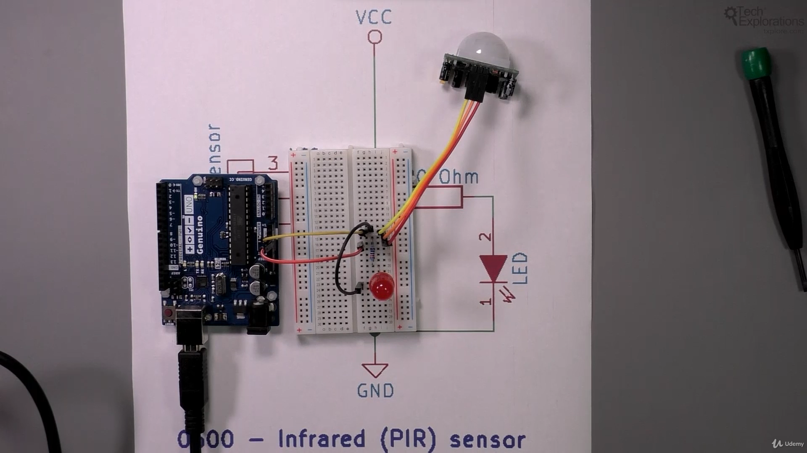
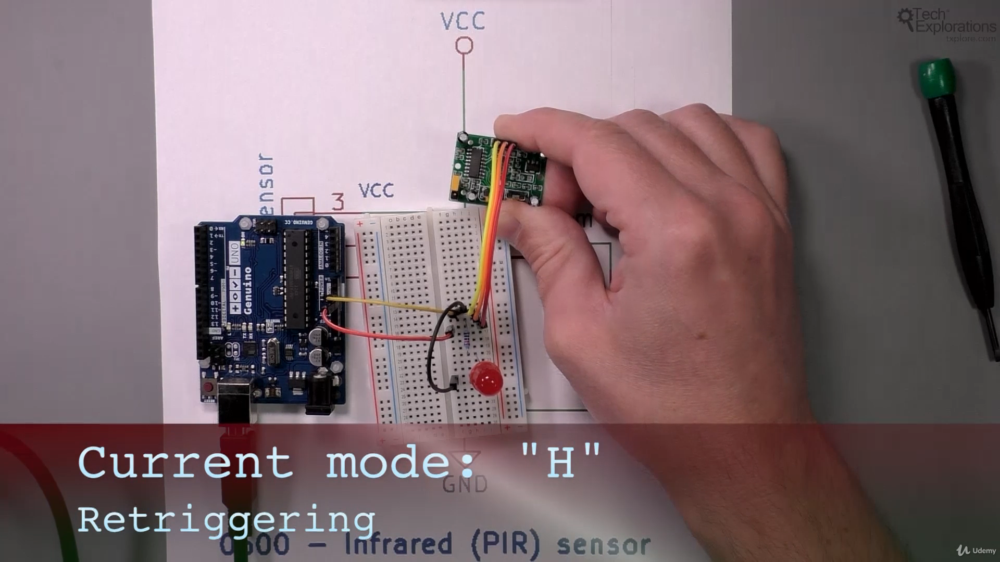

116. [Introduction to this section](#116)
117. [Introduction to the Passive infra-Red (PIR) motion sensor](#117)
118. [A simple PIR experiment with an LED](#118)
119. [A demonstration of using the PIR sensor with the Arduino](#119)
120. [PIR sensor first demonstration sketch walkthrough](#120)
121. [PIR sensor second demonstration sketch walkthrough](#121)

---

### 116. Introduction to this section<a id="116"></a>

### 117. Introduction to the Passive infra-Red (PIR) motion sensor<a id="117"></a>


- Wiki Passive infrared sensor topic [click me](https://en.wikipedia.org/wiki/Passive_infrared_sensor)
- Wiki Absolute zero topic [click me](https://en.wikipedia.org/wiki/Absolute_zero)
- HC-SR501 PIR MOTION DETECTOR sensor datasheet [click me](https://www.mpja.com/download/31227sc.pdf)

### 118. A simple PIR experiment with an LED<a id="118"></a>






Review concept

- Retriggering mode: as long there will be movement LED will glow
- Non-retriggering mode: Led will glow once it detect first motion and remain off even after there will be other motion after it

Note-
we can draw power from 9v battery in above setup instead of arduino

### 119. A demonstration of using the PIR sensor with the Arduino<a id="119"></a>

#### Schematic


```ino
/*  Infrred sensor demo sketch
 *
 * This sketch demonstrates the use of the PIR infrared motion sensor.
 *
 * This is an example of the minimum code needed to operate the PIR sensor
 * with the Arduino. A PIR sensor controls an LED, without the use of
 * an Arduino.
 *
 * This sketch was written for Arduino Step by Step by Peter Dalmaris.
 *
 * Components
 * ----------
 *  - Arduino Uno
 *  - Infrared motion sensor
 *  - An LED
 *  - A 220 Ohm resistor for the LED
 *
 *  Libraries
 *  ---------
 *  - None
 *
 * Connections
 * -----------
 *  Break out    |    Arduino Uno
 *  -----------------------------
 *      VCC      |      5V
 *      GND      |      GND
 *      OUT      |      4
 *
 * Also connect an LED to simulate a controlled device.
 *           220 Ohm
 *    3 ----/\/\/\/\----(LED |)----GND
 *
 *
 * Other information
 * -----------------
 * For information on PIR sensors: https://en.wikipedia.org/wiki/Passive_infrared_sensor
 * Datasheet: https://www.mpja.com/download/31227sc.pdf
 *
 *  Created on October 14 2016 by Peter Dalmaris
 *
 */

int ledPin   = 4;       // choose the pin for the LED
int inputPin = 3;      // choose the input pin (for PIR sensor)
int pirState = LOW;    // we start, assuming no motion detected
int val      = 0;      // variable for reading the pin status

//the time we give the sensor to calibrate (10-60 secs according to the datasheet)
int calibrationTime = 30; //This time is in seconds

void setup() {
  pinMode(ledPin, OUTPUT);      // declare LED as output
  pinMode(inputPin, INPUT);     // declare sensor as input

  Serial.begin(9600);
  Serial.println("Waiting for the sensor to warm up.");
//  delay(calibrationTime * 1000); // Convert the time from seconds to milliseconds.
  Serial.println("SENSOR ACTIVE");
}

void loop(){
  val = digitalRead(inputPin);  // read input value

  if (val == HIGH) {            // check if the input is HIGH
    digitalWrite(ledPin, HIGH);  // turn LED ON
    if (pirState == LOW) {
      // we have just turned on
      Serial.println("Motion detected!");
      // We only want to print on the output change, not state
      pirState = HIGH;
    }
  } else {
    digitalWrite(ledPin, LOW); // turn LED OFF
    if (pirState == HIGH){
      // we have just turned off
      Serial.println("Motion ended!");
      // We only want to print on the output change, not state
      pirState = LOW;
    }
  }
  delay(1000);
}

```

#### 2 sketch: LED will glow for 5 sec -retriggering mode

```ino
/*  Infrred sensor demo sketch
 *
 * This sketch demonstrates the use of the PIR infrared motion sensor.
 *
 * The sketch adds to the bare minimum version by allowing extra time
 * after the sensor goes LOW for the LED to remain HIGH. This could be
 * useful in a scenario where you want a light to go on in a room when
 * someone enters it, but to turn of a few minutes after they leave it.
 *
 * This sketch was adapted from the original that comes with the
 * Adafruit library for Arduino Step by Step by Peter Dalmaris.
 *
* Components
 * ----------
 *  - Arduino Uno
 *  - Infrared motion sensor
 *  - An LED
 *  - A 220 Ohm resistor for the LEd
 *
 *  Libraries
 *  ---------
 *  - None
 *
 * Connections
 * -----------
 *  Break out    |    Arduino Uno
 *  -----------------------------
 *      VCC      |      5V
 *      GND      |      GND
 *      OUT      |      4
 *
 * Also connect an LED to simulate a controlled device.
 *           220 Ohm
 *    3 ----/\/\/\/\----(LED |)----GND

 *
 * Other information
 * -----------------
 * For information on PIR sensors: https://en.wikipedia.org/wiki/Passive_infrared_sensor
 * Datasheet: https://www.mpja.com/download/31227sc.pdf
 *
 *  Created on October 14 2016 by Peter Dalmaris
 *
 */

int ledPin   = 4;             // choose the pin for the LED
int inputPin = 3;             // choose the input pin (for PIR sensor)
int pirState = true;          // we start, assuming no motion detected
int val      = 0;             // variable for reading the pin status
int minSecAfterPIRLow = 5000; // If the sensor reports low
                              // remain HIGH for this many milliseconds
long unsigned int timeTurnedLow;
boolean takeLowTime;  //This variable is used to record the event where the sensor turns off

//the time we give the sensor to calibrate (10-60 secs according to the datasheet)
int calibrationTime = 30;

void setup() {
  pinMode(ledPin, OUTPUT);      // declare LED as output
  pinMode(inputPin, INPUT);     // declare sensor as input

  takeLowTime = LOW;

  Serial.begin(9600);

  Serial.println("Waiting for the sensor to warm up.");
  delay(calibrationTime * 1000); // Convert the time from seconds to milliseconds.
  Serial.println("SENSOR ACTIVE");
}

void loop(){
  val = digitalRead(inputPin);  // read input value

  if (val == HIGH) {            // check if the input is HIGH
    digitalWrite(ledPin, HIGH);  // turn LED ON
    if (pirState == LOW) {
      // we have just turned on
      Serial.println("Motion detected!");
      // We only want to print on the output change, not state
      pirState = HIGH;
    }
  } else {

    if (pirState == HIGH){
      // we have just turned off
      Serial.println("Motion ended!");
      // We only want to print on the output change, not state
      pirState = LOW;
      timeTurnedLow = millis(); //take the millis at the moment the sensor went LOW
    }
  }

  //This block checks to see if enough time has passed after the PRI went LOW.
  //If yes, and assuming that the PIR sensor did not go HIGH again, turn off the LED
  if(!pirState && (millis() - timeTurnedLow) > minSecAfterPIRLow){
     Serial.println("Extended time HIGH ended!");
     digitalWrite(ledPin, LOW); // turn LED OFF
    }

  delay(1000);
}

```

### 120. PIR sensor first demonstration sketch walkthrough<a id="120"></a>

```ino
/*  Infrred sensor demo sketch
 *
 * This sketch demonstrates the use of the PIR infrared motion sensor.
 *
 * This is an example of the minimum code needed to operate the PIR sensor
 * with the Arduino. A PIR sensor controls an LED, without the use of
 * an Arduino.
 *
 * This sketch was written for Arduino Step by Step by Peter Dalmaris.
 *
 * Components
 * ----------
 *  - Arduino Uno
 *  - Infrared motion sensor
 *  - An LED
 *  - A 220 Ohm resistor for the LED
 *
 *  Libraries
 *  ---------
 *  - None
 *
 * Connections
 * -----------
 *  Break out    |    Arduino Uno
 *  -----------------------------
 *      VCC      |      5V
 *      GND      |      GND
 *      OUT      |      4
 *
 * Also connect an LED to simulate a controlled device.
 *           220 Ohm
 *    3 ----/\/\/\/\----(LED |)----GND
 *
 *
 * Other information
 * -----------------
 * For information on PIR sensors: https://en.wikipedia.org/wiki/Passive_infrared_sensor
 * Datasheet: https://www.mpja.com/download/31227sc.pdf
 *
 *  Created on October 14 2016 by Peter Dalmaris
 *
 */

int ledPin   = 4;       // choose the pin for the LED
int inputPin = 3;      // choose the input pin (for PIR sensor)
int pirState = LOW;    // we start, assuming no motion detected
int val      = 0;      // variable for reading the pin status

//the time we give the sensor to calibrate (10-60 secs according to the datasheet)
int calibrationTime = 30; //This time is in seconds

void setup() {
  pinMode(ledPin, OUTPUT);      // declare LED as output
  pinMode(inputPin, INPUT);     // declare sensor as input

  Serial.begin(9600);
  Serial.println("Waiting for the sensor to warm up.");
//  delay(calibrationTime * 1000); // Convert the time from seconds to milliseconds.
  Serial.println("SENSOR ACTIVE");
}

void loop(){
  val = digitalRead(inputPin);  // read input value

  if (val == HIGH) {            // check if the input is HIGH
    digitalWrite(ledPin, HIGH);  // turn LED ON
    if (pirState == LOW) {
      // we have just turned on
      Serial.println("Motion detected!");
      // We only want to print on the output change, not state
      pirState = HIGH;
    }
  } else {
    digitalWrite(ledPin, LOW); // turn LED OFF
    if (pirState == HIGH){
      // we have just turned off
      Serial.println("Motion ended!");
      // We only want to print on the output change, not state
      pirState = LOW;
    }
  }
  delay(1000);
}

```

### 121. PIR sensor second demonstration sketch walkthrough<a id="121"></a>

```ino
/*  Infrred sensor demo sketch
 *
 * This sketch demonstrates the use of the PIR infrared motion sensor.
 *
 * The sketch adds to the bare minimum version by allowing extra time
 * after the sensor goes LOW for the LED to remain HIGH. This could be
 * useful in a scenario where you want a light to go on in a room when
 * someone enters it, but to turn of a few minutes after they leave it.
 *
 * This sketch was adapted from the original that comes with the
 * Adafruit library for Arduino Step by Step by Peter Dalmaris.
 *
* Components
 * ----------
 *  - Arduino Uno
 *  - Infrared motion sensor
 *  - An LED
 *  - A 220 Ohm resistor for the LEd
 *
 *  Libraries
 *  ---------
 *  - None
 *
 * Connections
 * -----------
 *  Break out    |    Arduino Uno
 *  -----------------------------
 *      VCC      |      5V
 *      GND      |      GND
 *      OUT      |      4
 *
 * Also connect an LED to simulate a controlled device.
 *           220 Ohm
 *    3 ----/\/\/\/\----(LED |)----GND

 *
 * Other information
 * -----------------
 * For information on PIR sensors: https://en.wikipedia.org/wiki/Passive_infrared_sensor
 * Datasheet: https://www.mpja.com/download/31227sc.pdf
 *
 *  Created on October 14 2016 by Peter Dalmaris
 *
 */

int ledPin   = 4;             // choose the pin for the LED
int inputPin = 3;             // choose the input pin (for PIR sensor)
int pirState = true;          // we start, assuming no motion detected
int val      = 0;             // variable for reading the pin status
int minSecAfterPIRLow = 5000; // If the sensor reports low
                              // remain HIGH for this many milliseconds
long unsigned int timeTurnedLow;
boolean takeLowTime;  //This variable is used to record the event where the sensor turns off

//the time we give the sensor to calibrate (10-60 secs according to the datasheet)
int calibrationTime = 30;

void setup() {
  pinMode(ledPin, OUTPUT);      // declare LED as output
  pinMode(inputPin, INPUT);     // declare sensor as input

  takeLowTime = LOW;

  Serial.begin(9600);

  Serial.println("Waiting for the sensor to warm up.");
  delay(calibrationTime * 1000); // Convert the time from seconds to milliseconds.
  Serial.println("SENSOR ACTIVE");
}

void loop(){
  val = digitalRead(inputPin);  // read input value

  if (val == HIGH) {            // check if the input is HIGH
    digitalWrite(ledPin, HIGH);  // turn LED ON
    if (pirState == LOW) {
      // we have just turned on
      Serial.println("Motion detected!");
      // We only want to print on the output change, not state
      pirState = HIGH;
    }
  } else {

    if (pirState == HIGH){
      // we have just turned off
      Serial.println("Motion ended!");
      // We only want to print on the output change, not state
      pirState = LOW;
      timeTurnedLow = millis(); //take the millis at the moment the sensor went LOW
    }
  }

  //This block checks to see if enough time has passed after the PRI went LOW.
  //If yes, and assuming that the PIR sensor did not go HIGH again, turn off the LED
  if(!pirState && (millis() - timeTurnedLow) > minSecAfterPIRLow){
     Serial.println("Extended time HIGH ended!");
     digitalWrite(ledPin, LOW); // turn LED OFF
    }

  delay(1000);
}

```
