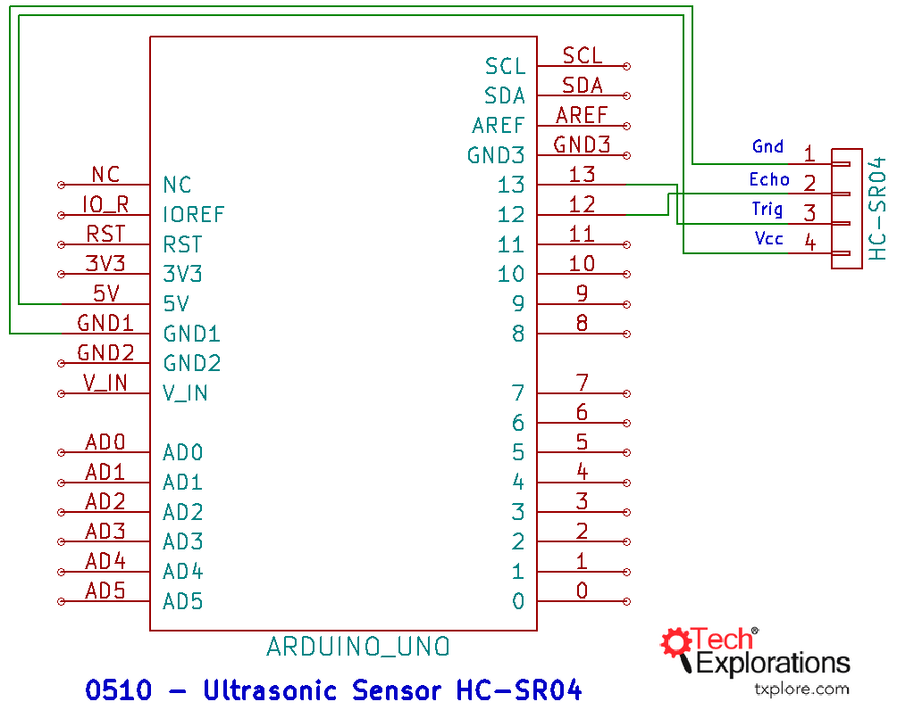
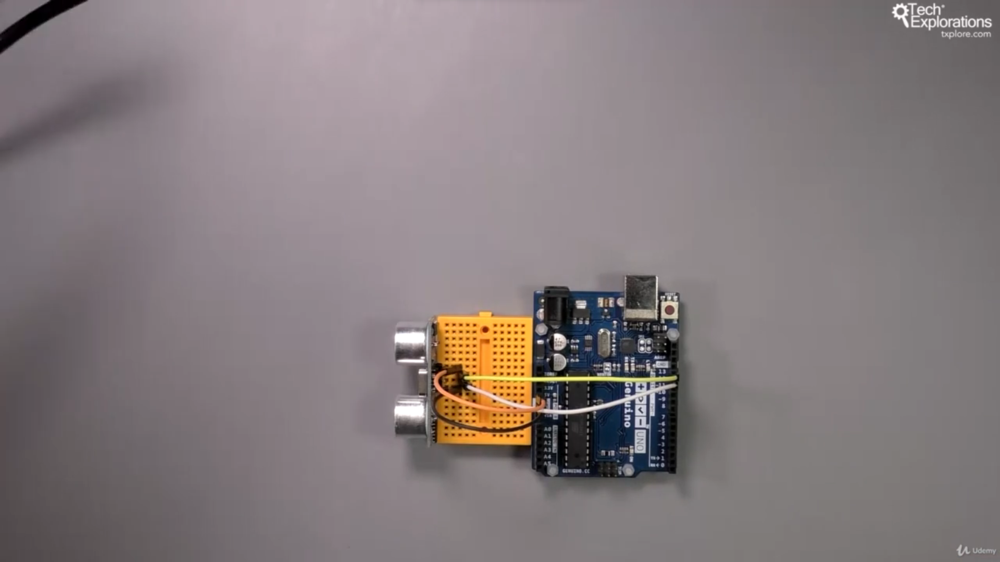
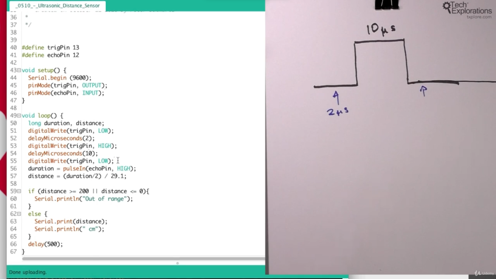
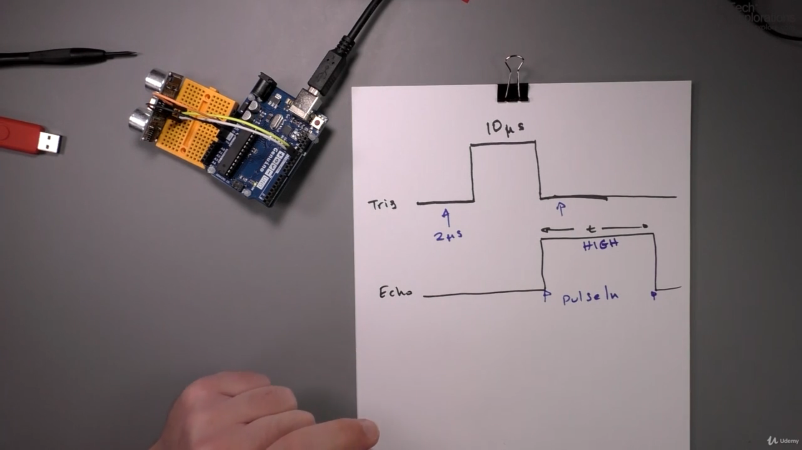
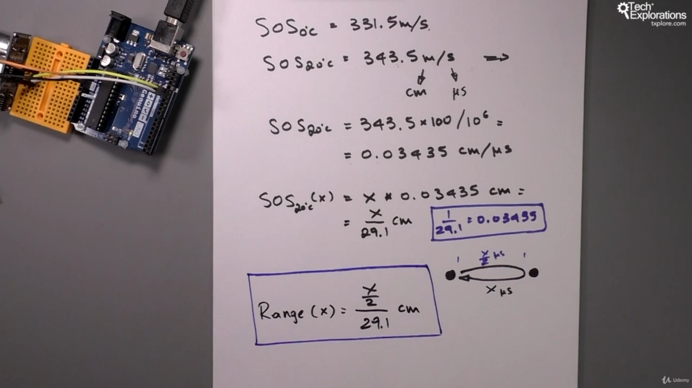
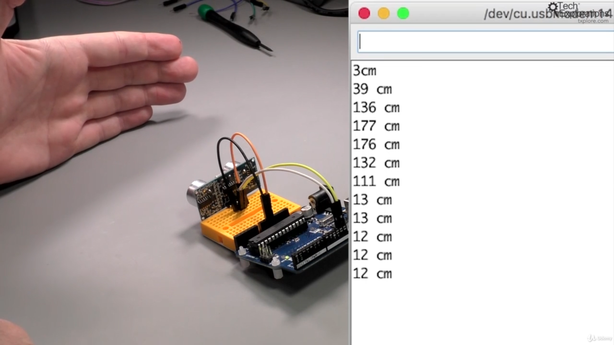

122. [Introduction to sensing distance](#122)
123. [Introduction to the ultrasonic distance sensor](#123)
124. [Wiring and understanding Trigger and Echo](#124)
125. [How to calculate distance](#125)

---

### 122. Introduction to sensing distance<a id="122"></a>

### 123. Introduction to the ultrasonic distance sensor<a id="123"></a>

- Wiki Ultrasound concept [click me](https://en.wikipedia.org/wiki/Ultrasound)
- Wiki Ultrasonic_transducer concept [click me](https://en.wikipedia.org/wiki/Ultrasonic_transducer)
- HC-SR04 ultrasonic sensor datasheet [click me](https://docs.google.com/document/d/1Y-yZnNhMYy7rwhAgyL_pfa39RsB-x2qR4vP8saG73rE/edit)

### 124. Wiring and understanding Trigger and Echo<a id="124"></a>





- Wiki Oscilloscope topic [click me](https://en.wikipedia.org/wiki/Oscilloscope)

### 125. How to calculate distance<a id="125"></a>

#### Trigger ping



#### Echo ping



#### derived formula



#### Output



```ino
/*  Ultrasonic distance sensor HC-SR04 demo sketch
 *
 * This sketch calculates the distance between the HC-SR04 sensor and
 * an object directly infront of it.
 *
 *
 * This sketch was written for Arduino Step by Step by Peter Dalmaris.
 *
 * Components
 * ----------
 *  - Arduino Uno
 *  - HC-SR04 sensor
 *
 *  Libraries
 *  ---------
 *  - NONE
 *
 * Connections
 * -----------
 *  Break out    |    Arduino Uno
 *  -----------------------------
 *      VCC      |      5V
 *      GND      |      GND
 *      Echo     |      12
 *      Trig     |      13
 *
 *
 * Other information
 * -----------------
 *  For information on the ultrasonic transducer: https://en.wikipedia.org/wiki/Ultrasonic_transducer
 *  For information on ultrasounds: https://en.wikipedia.org/wiki/Ultrasound
 *  HC-SR04 datasheet: https://docs.google.com/document/d/1Y-yZnNhMYy7rwhAgyL_pfa39RsB-x2qR4vP8saG73rE
 *  Information about the pulseIn function: https://www.arduino.cc/en/Reference/PulseIn
 *
 *  Created on October 21 2016 by Peter Dalmaris
 *
 */


#define trigPin 13
#define echoPin 12

void setup() {
  Serial.begin (9600);
  pinMode(trigPin, OUTPUT);
  pinMode(echoPin, INPUT);
}

void loop() {
  long duration, distance;
  digitalWrite(trigPin, LOW);
  delayMicroseconds(2);
  digitalWrite(trigPin, HIGH);
  delayMicroseconds(10);
  digitalWrite(trigPin, LOW);
  duration = pulseIn(echoPin, HIGH);
  distance = (duration/2) / 29.1;

  if (distance >= 200 || distance <= 0){
    Serial.println("Out of range");
  }
  else {
    Serial.print(distance);
    Serial.println(" cm");
  }
  delay(500);
}
```

- Ardunio uno r3 documentation pulseIn() function [click me](https://www.arduino.cc/reference/en/language/functions/advanced-io/pulsein/)

Note-

- There are function that we use over and over again they are common function ex: digitalRead(), digitalWrite()
- There are function that are board specific function, that we used when we are using specific breakout board ex: pulseIn() etc...

#### Paradigm shift:

- App feature specific function (learn few while making specific app) VS open Library and learning every function without knowing which feature to use with
