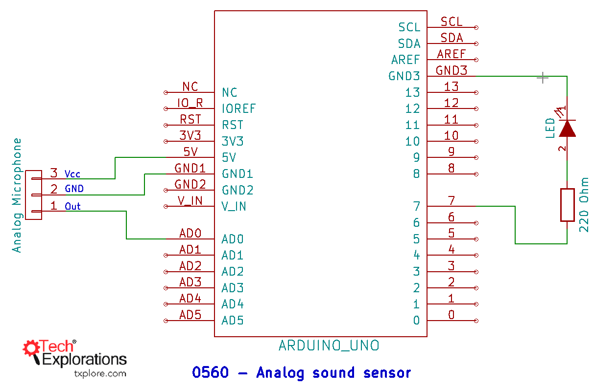
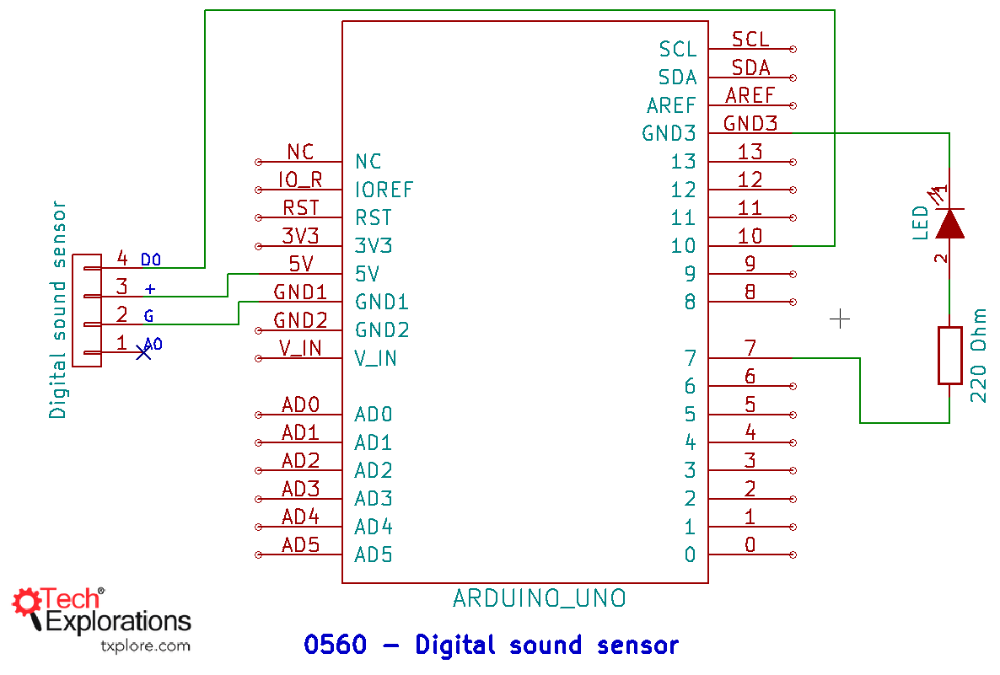

126. [Introduction to sensing sound](#126)
127. [Introduction to the analog sound sensor](#127)
128. [A demonstration and sketch of the analog sound sensor](#128)
129. [A demonstration and sketch of the digital sound sensor](#129)

---

### 126. Introduction to sensing sound<a id="126"></a>

### 127. Introduction to the analog sound sensor<a id="127"></a>

- Wiki Signal processing topic [click me](https://en.wikipedia.org/wiki/Signal_processing)

### 128. A demonstration and sketch of the analog sound sensor<a id="128"></a>



- Wiki Loudness concept [click me](https://en.wikipedia.org/wiki/Loudness)

- Wiki Audio signal processing topic [click me](https://en.wikipedia.org/wiki/Audio_signal_processing)

```ino
/*  Analog microphone demo sketch
 *
 * This sketch detects loud noises using an analog electrelet microphone.
 *
 * This sketch was written for Arduino Step by Step by Peter Dalmaris.
 *
 * Components
 * ----------
 *  - Arduino Uno
 *  - Analog electrelet microphone
 *
 *  Libraries
 *  ---------
 *  - None
 *
 * Connections
 * -----------
 *  Break out    |    Arduino Uno
 *  -----------------------------
 *      VCC      |      5V
 *      GND      |      GND
 *      AUD      |      A0

 *
 * Other information
 * -----------------
 *  This code is useful if you want to do things like detect a knock on a door,
 *  hands clapping, etc.
 *
 *  Created on October 14 2016 by Peter Dalmaris
 *
 */

int currentValue;
int maxValue;
int minValue;
unsigned long timer;
int sampleSpan  = 200; // Amount in milliseconds to sample data
int volume;            // this roughly goes from 0 to 700
int ledpin      = 7;

void setup()
{
    Serial.begin(9600);
    pinMode (ledpin, OUTPUT);
    resetValues();
}

void loop()
{
    currentValue = analogRead(A0);

    if (currentValue < minValue) {
        minValue = currentValue;
    }
    if (currentValue > maxValue) {
        maxValue = currentValue;
    }

    if (millis() - timer >= sampleSpan) {
        volume = maxValue - minValue;
        //Serial.println(volume);
        resetValues();
    }

    // I arbitrarily select 100 as the value above which the
    //microphone is picking a loud noise.
    if (volume > 400)
    {
      Serial.println("Loud");
      digitalWrite(ledpin,HIGH);
    } else
    {
      Serial.println("Quiet");
      digitalWrite(7,LOW);
    }

}

void resetValues()
{
    maxValue = 0;
    minValue = 1024;
    timer = millis();
}
```

### 129. A demonstration and sketch of the digital sound sensor<a id="129"></a>



```ino
/*  Digital sound sensor demo sketch
 *
 * This sketch detects loud noises using a digital sound sensor.
 *
 * When the sensor detects a loud noise, it sends a message to the
 * serial monitor.
 *
 * This sketch was written for Arduino Step by Step by Peter Dalmaris.
 *
 * Components
 * ----------
 *  - Arduino Uno
 *  - Digital sound sensor
 *
 *  Libraries
 *  ---------
 *  - None
 *
 * Connections
 * -----------
 *  Break out    |    Arduino Uno
 *  -----------------------------
 *      +        |      5V
 *      G        |      GND
 *      D0       |      10

 *
 * Other information
 * -----------------
 *  This code is useful if you want to do things like detect a knock on a door,
 *  hands clapping, etc.
 *
 *  Created on October 14 2016 by Peter Dalmaris
 *
 */

int soundDetectedPin = 10;          // Use Pin 10 as our Input
int soundDetectedVal = HIGH;        // This is where we record our Sound Measurement
boolean bAlarm       = false;
unsigned long lastSoundDetectTime; // Record the time that we measured a sound
int soundAlarmTime   = 500;        // Number of milli seconds to keep the sound alarm high
int ledpin           = 7;

void setup ()
{
  Serial.begin(9600);
  pinMode (soundDetectedPin, INPUT) ; // input from the Sound Detection Module
  pinMode (ledpin, OUTPUT);               // The built-in LED on pin 13 will light
                                      // up when there is a noise.
}
void loop ()
{
  soundDetectedVal = digitalRead (soundDetectedPin) ; // read the sound alarm time
  if (soundDetectedVal == HIGH) // If we hear a sound
  {
    digitalWrite(ledpin,HIGH); // Turn the LED on to show there was a loud noise
    lastSoundDetectTime = millis(); // record the time of the sound alarm
    // This will output the LOUD message only once even if the signal remains
    // at HIGH. This way it will not scroll out of the window with the same message.
    if (!bAlarm){
      Serial.println("LOUD!");
      bAlarm = true;
    }
  }

  if( (millis()-lastSoundDetectTime) > soundAlarmTime  &&  bAlarm){
    Serial.println("quiet");
    digitalWrite(ledpin,LOW);
    bAlarm = false;
  }

}
```
