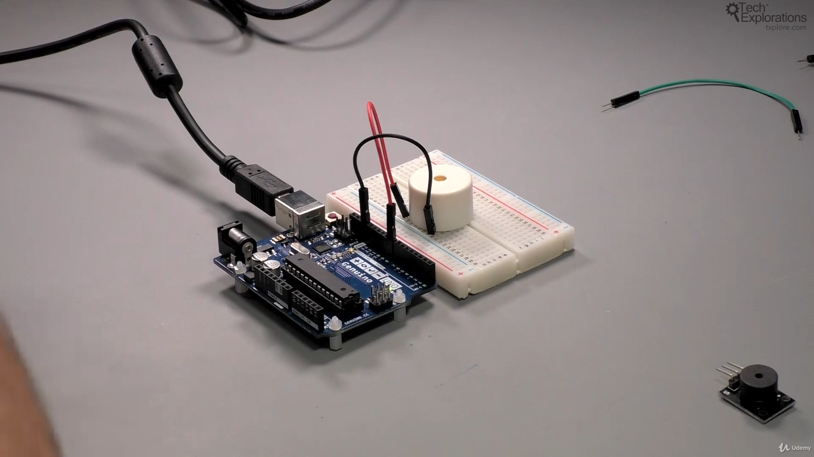

130. [Introduction to this section](#130)
131. [Introduction to the buzzer](#131)
132. [Playing music](#132)
133. [Control the sound volume](#133)

---

### 130. Introduction to this section<a id="130"></a>

### 131. Introduction to the buzzer<a id="131"></a>

#### passive buzzer 2 pin



#### powered passive buzzer 3 pin


- Same code for both schematic

```ino
/*  Passive buzzer demo sketch 1
 *
 * This sketch shows you how to play a tone using a passive
 * buzzer and the tone function that comes with the standard
 * Arduino library
 *
 * This sketch was written for Arduino Step by Step by Peter Dalmaris.
 *
 * Components
 * ----------
 *  - Arduino Uno
 *  - Passive buzzer with two or three pins
 *
 *  Libraries
 *  ---------
 *  - None
 *
 * Connections
 * -----------
 *  If you have a two pin passive buzzer, connect the pin marked "-"
 *  to Arduino GND, and the other pin to Arduino pin 8.
 *
 *  If you have a three pin passive buzzer, connect the pin marked "-"
 *  to GND, the pin marked "S" to Arduino digital pin 8, and the last
 *  pin to Arduino pin 5V.
 *
 *  Created on November 21 2016 by Peter Dalmaris
 *
 */

const int buzzer = 8;

void setup(){
  pinMode(buzzer, OUTPUT); // Set buzzer - pin 8 as an output
}

void loop(){
  tone(buzzer, 1000); // Send 1KHz sound signal...
  delay(1000);        // ...for 1 sec
  noTone(buzzer);     // Stop sound...
  delay(1000);        // ...for 1sec
}
```

- Ardunio uno r3 documentation tone() function [click me](https://www.arduino.cc/reference/en/language/functions/advanced-io/tone/)

- Ardunio uno r3 documentation noTone() function [click me](https://www.arduino.cc/reference/en/language/functions/advanced-io/notone/)

### 132. Playing music<a id="132"></a>

- Open arduino, go to file--> example--> digital--> tone melody

### 133. Control the sound volume<a id="133"></a>

#### passive 2 pin buzzer


#### powered passive 3 pin buzzer


- Same code for both schematic

```ino
/*  Passive buzzer demo sketch 1
 *
 * This sketch shows you how to play a tone using a passive
 * buzzer and the tone function that comes with the standard
 * Arduino library
 *
 * This sketch was written for Arduino Step by Step by Peter Dalmaris.
 *
 * Components
 * ----------
 *  - Arduino Uno
 *  - Passive buzzer with two or three pins
 *
 *  Libraries
 *  ---------
 *  - None
 *
 * Connections
 * -----------
 *  If you have a two pin passive buzzer, connect the pin marked "-"
 *  to Arduino GND, and the other pin to Arduino pin 8.
 *
 *  If you have a three pin passive buzzer, connect the pin marked "-"
 *  to GND, the pin marked "S" to Arduino digital pin 8, and the last
 *  pin to Arduino pin 5V.
 *
 *  Created on November 21 2016 by Peter Dalmaris
 *
 */

const int buzzer = 8;

void setup(){
  pinMode(buzzer, OUTPUT); // Set buzzer - pin 8 as an output
}

void loop(){
  tone(buzzer, 1000); // Send 1KHz sound signal...
  delay(1000);        // ...for 1 sec
  noTone(buzzer);     // Stop sound...
  delay(1000);        // ...for 1sec
}
```

Note-

- The arduino produce same intensity signal that why we need some external hardware i.e potentiometer to control volume
