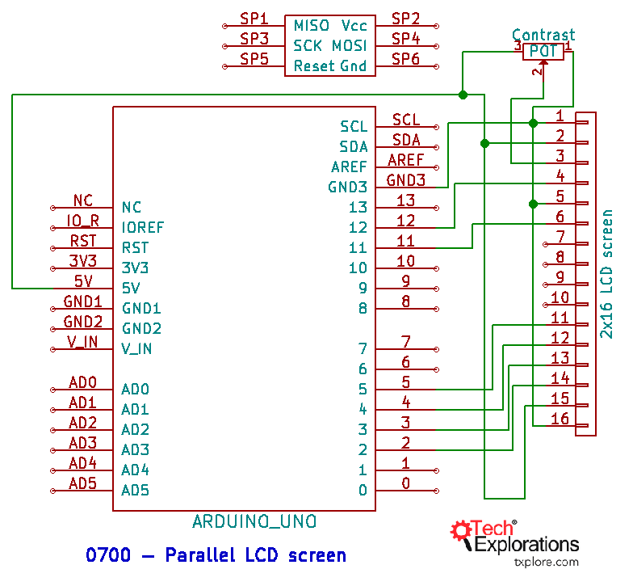
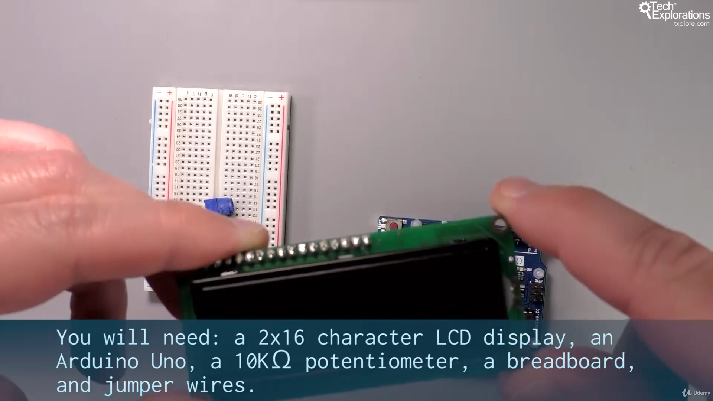
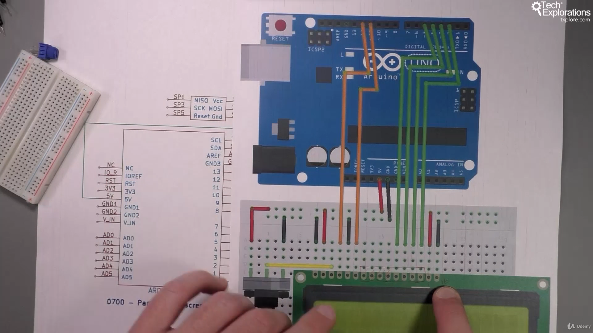
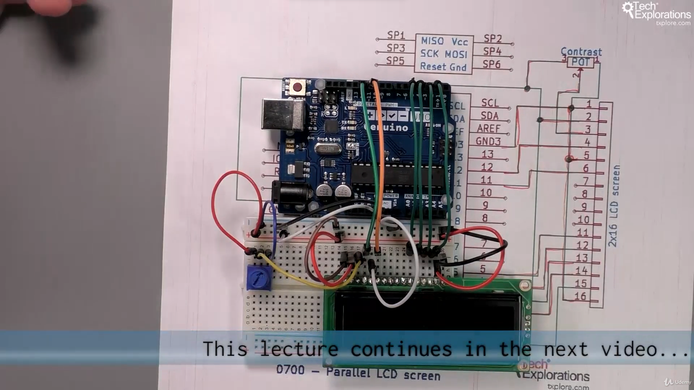
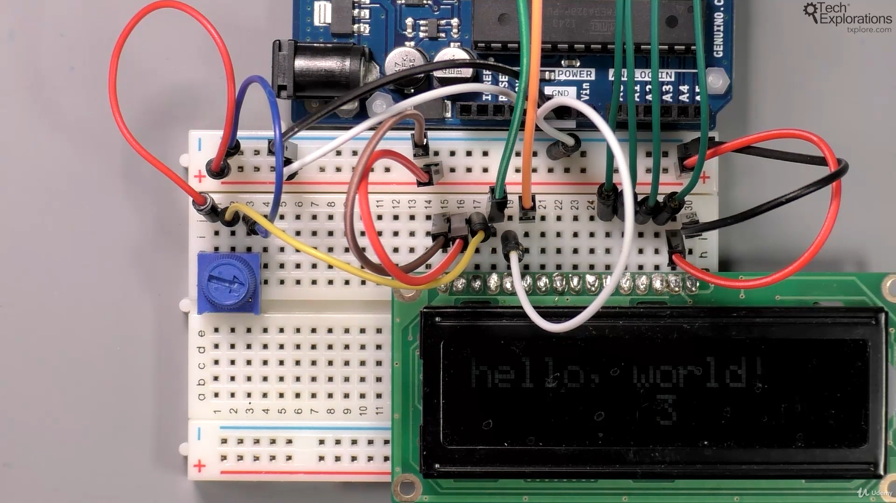
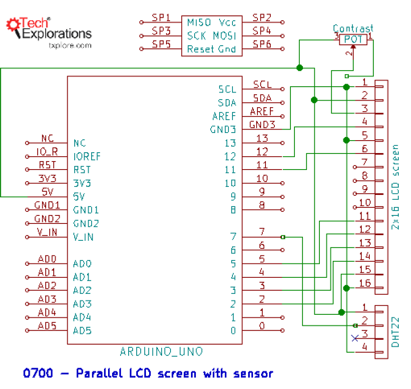
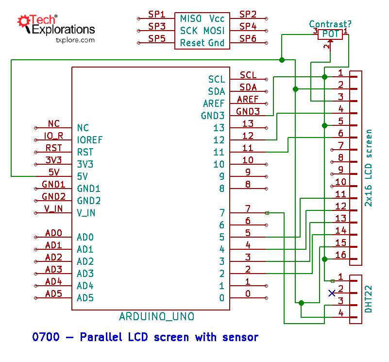
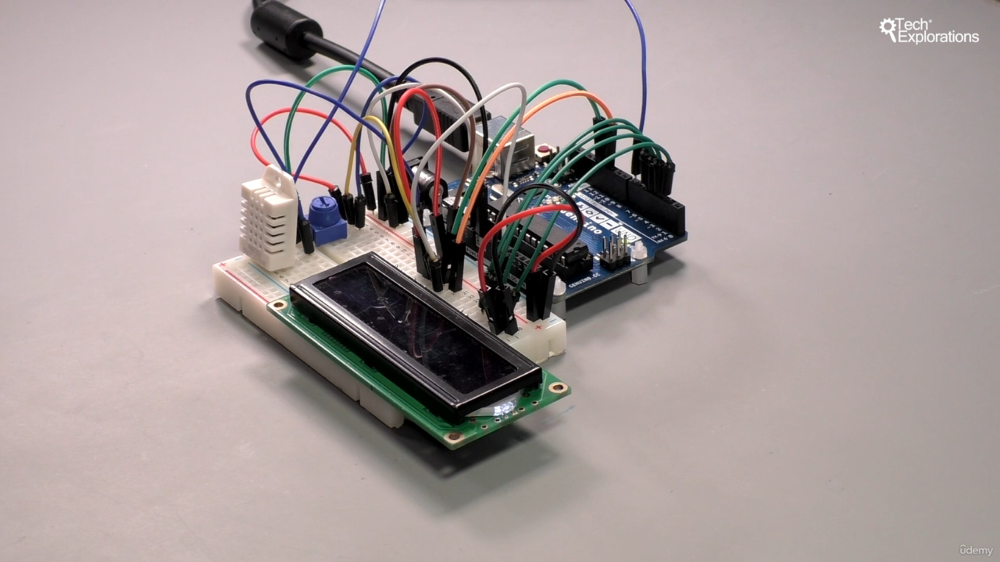
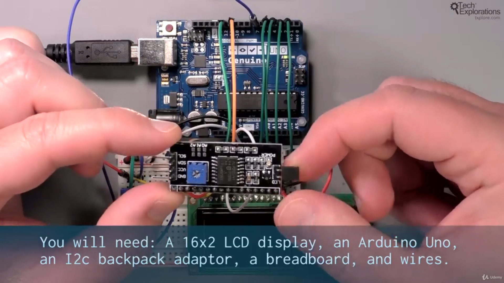
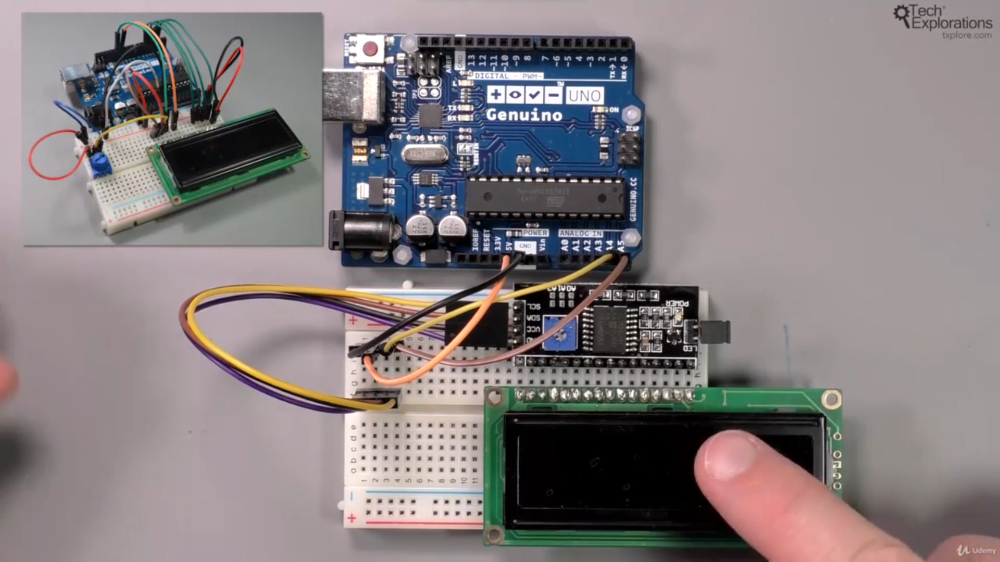

134. [Introduction to this section](#134)
135. [Introduction to the LCD](#135)
136. [LCD wiring in 4-bit parallel mode](#136)
137. [LCD demonstration sketch](#137)
138. [Display sensor data in the LCD](#138)
139. [Connect LCD using the I2C adaptor](#139)
140. [Using the RGB LCD and buttons shield](#140)

---

### 134. Introduction to this section<a id="134"></a>

### 135. Introduction to the LCD<a id="135"></a>

### 136. LCD wiring in 4-bit parallel mode<a id="136"></a>









### 137. LCD demonstration sketch<a id="137"></a>

```ino
/*  LCD screen demo sketch
 *
 * This sketch shows you how to use the 16x2 LCD display in
 * 4-bit mode with the Arduino Uno.
 *
 * The LiquidCrystal
 * library works with all LCD displays that are compatible with the
 * Hitachi HD44780 driver. There are many of them out there, and you
 * can usually tell them by the 16-pin interface.
 *
 * Components
 * ----------
 *  - Arduino Uno
 *  - 10KOhm potentiometer
 *  - jumper wires
 *  - Breadboard
 *
 *  Libraries
 *  ---------
 *  - LiquidCrystal (comes with Arduino IDE)
 *
 * Connections
 * -----------
 *  LCD screen    |    Arduino Uno
 *  -----------------------------
 *      1  (Vss)  |      GND
 *      2  (Vdd)  |      5V
 *      3  (VO)   |      Potentiometer
 *      4  (RS)   |      12
 *      5  (RW)   |      GND
 *      6  (E)    |      11
 *      7  (D0)   |      Not connected
 *      8  (D1)   |      Not connected
 *      9  (D2)   |      Not connected
 *      10 (D3)   |      Not connected
 *      11 (D4)   |      5
 *      12 (D5)   |      4
 *      13 (D6)   |      3
 *      14 (D7)   |      2
 *      15 (A)    |      5V
 *      16 (K)    |      GND
 *
 * For the potentiometer, connect the middle pin
 * to pin 3 (V0) of the display. The other two, connect
 * to 5V and GND. It doesn't matter which pin goes to
 * 5V and to GND.
 *
 * Other information
 * -----------------
 *  For information on the LiquidCrystal library: https://www.arduino.cc/en/Reference/LiquidCrystal
 *
 *  Created on November 18 2016 by Peter Dalmaris
 *
 */

// include the library code:
#include <LiquidCrystal.h>

// initialize the library with the numbers of the interface pins
LiquidCrystal lcd(12, 11, 5, 4, 3, 2);

void setup() {
  // set up the LCD's number of columns and rows:
  lcd.begin(16, 2);
  // Print a message to the LCD.
  lcd.print("hello, world!");
}

void loop() {
  // set the cursor to column 0, line 1
  // (note: line 1 is the second row, since counting begins with 0):
  lcd.setCursor(0, 1);
  // print the number of seconds since reset:
  lcd.print(millis()/1000);
}
```

#### Output



### 138. Display sensor data in the LCD<a id="138"></a>





#### Output


```ino
/*  LCD screen with DHT22 sensor demo sketch
 *
 * This sketch shows you how to use the 16x2 LCD display in
 * 4-bit mode with the Arduino Uno, and display data from
 * the DHT22 sensor.
 *
 * The LiquidCrystal library works with all LCD displays that are
 * compatible with the Hitachi HD44780 driver. There are many
 * of them out there, and you  can usually tell them by the
 * 16-pin interface.
 *
 * Components
 * ----------
 *  - Arduino Uno
 *  - 10KOhm potentiometer
 *  - DHT22
 *  - 10KOhm resistor for the sensor
 *  - jumper wires
 *  - Breadboard
 *
 *  Libraries
 *  ---------
 *  - LiquidCrystal (comes with Arduino IDE)
 *  - DHT
 *
 * Connections
 * -----------
 *  LCD screen    |    Arduino Uno
 *  -----------------------------
 *      1  (Vss)  |      GND
 *      2  (Vdd)  |      5V
 *      3  (VO)   |      Potentiometer
 *      4  (RS)   |      12
 *      5  (RW)   |      GND
 *      6  (E)    |      11
 *      7  (D0)   |      Not connected
 *      8  (D1)   |      Not connected
 *      9  (D2)   |      Not connected
 *      10 (D3)   |      Not connected
 *      11 (D4)   |      5
 *      12 (D5)   |      4
 *      13 (D6)   |      3
 *      14 (D7)   |      2
 *      15 (A)    |      5V
 *      16 (K)    |      GND
 *
 * For the potentiometer, connect the middle pin
 * to pin 3 (V0) of the display. The other two, connect
 * to 5V and GND. It doesn't matter which pin goes to
 * 5V and to GND.
 *
 * For the DHT22:
 *
 *  * Hold the sensor so that the grill is towards you. Here are the connections
 *
 *     -----------
 *     | - |  -  |
 *     | - |  -  |
 *     | - |  -  |
 *     | - |  -  |
 *     -----------
 *     |  |  |  |
 *     |  |  |  |
 *     |  |  |  |
 *     |  |  |  |
 *    5V  2     GND
 *      data
 *
 * Connect a 10KOhm resistor between the 5V and data pin (2)
 *
 * Other information
 * -----------------
 *  For information on the LiquidCrystal library: https://www.arduino.cc/en/Reference/LiquidCrystal
 *
 *  Created on November 18 2016 by Peter Dalmaris
 *
 */

#include <LiquidCrystal.h>
#include "DHT.h"

#define DHTPIN 7     // what pin we're connected to
#define DHTTYPE DHT22   // DHT 22  (AM2302)
DHT dht(DHTPIN, DHTTYPE);

// initialize the library with the numbers of the interface pins
LiquidCrystal lcd(12, 11, 5, 4, 3, 2);

void setup() {
  // set up the LCD's number of columns and rows:
  lcd.begin(16, 2);
  // Print a message to the LCD.
  lcd.print("DHT test");
  dht.begin();
}

void loop() {
  float h = dht.readHumidity();
  float t = dht.readTemperature();

  // check if returns are valid, if they are NaN (not a number) then something went wrong!
  if (isnan(t) || isnan(h)) {
    lcd.clear();
    lcd.setCursor(0, 0);
    lcd.print("Can't get reading");
    lcd.setCursor(0, 1);
    lcd.print("from DHT");

  } else {
    lcd.clear();
    lcd.setCursor(0, 0);
    lcd.print("Hum: ");
    lcd.print(h);
    lcd.print(" %");
    lcd.setCursor(0, 1);
    lcd.print("Temp: ");
    lcd.print(t);
    lcd.print(" *C");
  }
}
```

### 139. Connect LCD using the I2C adaptor<a id="139"></a>





#### output



```ino
/*  LCD screen with the I2C backpack demo sketch
 *
 * This sketch shows you how to use the 16x2 LCD display
 * using the I2C backpack adaptor. This way, we can save a
 * lot of digital pins on the Arduino.
 *
 * This I2C LCD backpack contains the PCF8574 port-expander
 * IC. Beware that this sketch can work with backpacks that
 * contains this IC, but may not work with variations.
 *
 *
 * Components
 * ----------
 *  - Arduino Uno
 *  - An I2C to LCD backpack adaptor
 *  - jumper wires
 *  - Breadboard
 *
 *  Libraries
 *  ---------
 *  - LCD
 *  - LiquidCrystal_I2C
 *
 * Connections
 * -----------
 *  I2C backpack  |    Arduino Uno
 *  -----------------------------
 *      GND       |      GND
 *      Vcc       |      5V
 *      SDA       |      SDA or A4
 *      SCL       |      SCL or A5
 *
 *
 * Other information
 * -----------------
 *  For information on the LiquidCrystal library: https://github.com/marcoschwartz/LiquidCrystal_I2C
 *
 *  Created on November 18 2016 by Peter Dalmaris
 *
 */

#include <LiquidCrystal_I2C.h>

LiquidCrystal_I2C lcd(0x27,16,2);

void setup()
{
    lcd.init();
    lcd.backlight();
    lcd.setCursor(0, 0);
    lcd.print("Hello world!");
    lcd.setCursor(0, 1);
    lcd.print("Row number: ");
    lcd.setCursor(12, 1);
    lcd.print("2");
}
void loop()
{

}
```

### 140. Using the RGB LCD and buttons shield<a id="140"></a>

- MCP23017/MCP23S17 datasheet [click me](https://ww1.microchip.com/downloads/en/DeviceDoc/20001952C.pdf)
